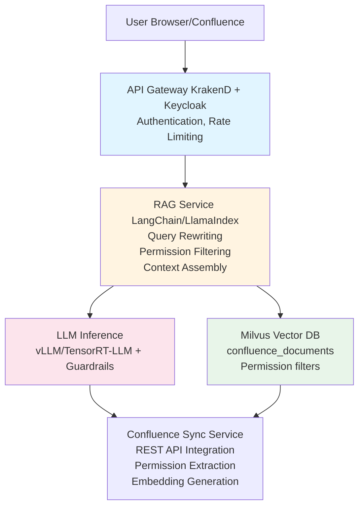

# Confluence Document Search with RAG

A reference architecture for implementing secure, permission-aware document search in Confluence using RAG (Retrieval-Augmented Generation) with enterprise security and access control.

## TL;DR

Got thousands of Confluence pages and users can't find anything? This architecture lets users search Confluence in plain English while respecting all your existing permissions. Users ask questions, get answers from documents they're allowed to see. Expect 2-4 months implementation with 2-4 engineers.

**Quick Assessment**:
- **Complexity**: ⭐⭐⭐ (3/5) - Moderate complexity, requires Confluence API knowledge
- **Time to Deploy**: 2-4 months for full implementation
- **Team Size**: 2-4 engineers (Backend Developer, ML Engineer, DevOps)
- **Cost Estimate**: $30K-$100K first year (infrastructure + development)
- **Minimum Maturity Level**: Level 2 (Managed)

**Before You Start**:
- [ ] Do you have Confluence with API access?
- [ ] Are permissions well-defined in Confluence?
- [ ] Do you have a vector database (Milvus) set up?
- [ ] Can you commit to 2+ month implementation timeline?

**When NOT to Use This Architecture**:
- Small Confluence (< 1000 pages) - built-in search might be enough
- No clear permission model - fix permissions first
- Need real-time updates (< 1 minute) - sync takes time
- Public Confluence only - overkill if everything is public

## Overview

This architecture lets your users search and query Confluence documents using natural language, while strictly respecting Confluence's permission model. The system only retrieves documents users are allowed to see and provides contextual answers based on authorized content. Think of it as Google for your internal Confluence, but with security built in.

## Business Value

- **Knowledge Discovery**: Quickly find relevant information across thousands of Confluence pages
- **Permission-Aware**: Respects existing Confluence access controls
- **Natural Language**: Query documents using conversational language
- **Contextual Answers**: Get synthesized answers, not just search results
- **Audit Trail**: Complete logging of document access and queries

## Architecture Components

### 1. Data Ingestion Layer

#### Confluence Integration
- **Confluence REST API**: Periodic sync of pages and spaces
- **Permission Extraction**: Extract user/group permissions per page
- **Change Detection**: Webhook or polling for page updates
- **Metadata Extraction**: Page metadata, labels, space information

#### Document Processing Pipeline
Here's how we process documents before they go into the vector database:

- **Text Extraction**: Extract text from Confluence storage format - handle tables, code blocks, etc.
- **Chunking**: Split documents into semantic chunks (500-1000 tokens) - too small loses context, too large loses precision
- **Embedding Generation**: Create embeddings using enterprise models - we recommend BGE-large or similar
- **Metadata Enrichment**: Add permission tags, space info, page IDs - this is critical for filtering

### 2. Vector Database Layer

#### Milvus Configuration
- **Collection Structure**:
  - Primary collection: `confluence_documents`
  - Partition by space: `space_{space_key}`
  - Metadata fields:
    - `page_id`: Confluence page ID
    - `space_key`: Confluence space key
    - `permission_groups`: List of groups with access
    - `permission_users`: List of users with access
    - `page_title`: Page title
    - `last_modified`: Last update timestamp
    - `chunk_index`: Chunk position in document

#### Access Control
- **Row-Level Security**: Filter by user/group permissions
- **Dynamic Filtering**: Apply permission filters at query time
- **Namespace Isolation**: Separate collections per security classification

### 3. RAG Pipeline

#### Query Processing
- **Query Rewriting**: Enhance user queries for better retrieval
- **Permission Context**: Inject user's groups/permissions into query
- **Multi-Stage Retrieval**: 
  1. Coarse-grained retrieval (top 50)
  2. Permission filtering
  3. Re-ranking (top 10)

#### Context Assembly
- **Chunk Aggregation**: Combine related chunks from same document
- **Source Attribution**: Track source pages for citations
- **Context Window Management**: Fit within model context limits

### 4. LLM Layer

#### Model Selection
- **Embedding Model**: Enterprise-grade embedding model (e.g., BGE-large)
- **Generation Model**: vLLM or TensorRT-LLM for inference
- **Guardrails**: NeMo Guardrails for content filtering

#### Response Generation
- **Prompt Template**: Structured prompt with context and instructions
- **Citation Generation**: Include source page links
- **Confidence Scoring**: Indicate answer confidence level

### 5. Access Control & Security

#### Authentication
- **Keycloak Integration**: SSO with Confluence authentication
- **Token Validation**: Validate user tokens and extract groups
- **Session Management**: Short-lived session tokens

#### Authorization
- **Permission Mapping**: Map Confluence permissions to vector DB filters
- **OPA Policies**: Fine-grained authorization policies
- **Audit Logging**: Log all document access attempts

### 6. API & UI Layer

#### API Endpoints
- `/api/v1/search`: Document search endpoint
- `/api/v1/query`: Natural language query endpoint
- `/api/v1/sources`: Get source documents for answer

#### Web UI
- **OpenWebUI Integration**: Custom plugin for Confluence search
- **Confluence Macro**: Embed search widget in Confluence pages
- **Chat Interface**: Conversational interface for queries

## Architecture Diagram



## Implementation Details

### Confluence Sync Service

```python
# Pseudo-code for Confluence sync
class ConfluenceSyncService:
    def sync_space(self, space_key: str):
        # Fetch all pages in space
        pages = confluence_api.get_pages(space_key)
        
        for page in pages:
            # Extract permissions
            permissions = self.extract_permissions(page)
            
            # Extract and chunk content
            chunks = self.chunk_document(page.content)
            
            # Generate embeddings
            embeddings = embedding_model.encode(chunks)
            
            # Store in Milvus with metadata
            milvus.insert(
                vectors=embeddings,
                metadata={
                    'page_id': page.id,
                    'space_key': space_key,
                    'permission_groups': permissions['groups'],
                    'permission_users': permissions['users'],
                    'title': page.title,
                    'chunk_index': range(len(chunks))
                }
            )
```

### Permission-Aware Retrieval

```python
# Pseudo-code for permission-aware search
class PermissionAwareRAG:
    def search(self, query: str, user: User):
        # Get user's groups and permissions
        user_groups = user.get_groups()
        user_id = user.id
        
        # Generate query embedding
        query_embedding = embedding_model.encode(query)
        
        # Search with permission filter
        results = milvus.search(
            vectors=[query_embedding],
            expr=f"permission_groups IN {user_groups} OR permission_users CONTAINS '{user_id}'",
            limit=50
        )
        
        # Re-rank and filter
        filtered_results = self.filter_by_permissions(results, user)
        
        return filtered_results[:10]
```

### Query Processing Flow

1. **User Query**: "How do I configure SSO in our system?"
2. **Query Enhancement**: "SSO configuration setup authentication single sign-on"
3. **Permission Context**: Add user's groups to filter
4. **Vector Search**: Search Milvus with permission filter
5. **Re-ranking**: Score and rank results
6. **Context Assembly**: Combine top chunks
7. **LLM Generation**: Generate answer with citations
8. **Response**: Return answer with source links

## Security Considerations

### Access Control
- **Permission Inheritance**: Respect Confluence permission inheritance
- **Space-Level Access**: Filter by space access permissions
- **Page-Level Access**: Filter by individual page permissions
- **Group Membership**: Sync with Active Directory groups

### Data Protection
- **Encryption**: Encrypt embeddings at rest
- **Audit Logging**: Log all document access
- **PII Handling**: Redact PII from indexed content if needed
- **Data Residency**: Control where embeddings are stored

### Threat Protection
- **Rate Limiting**: Prevent abuse of search endpoints
- **Input Validation**: Sanitize user queries
- **Output Filtering**: Guardrails on generated responses
- **Injection Prevention**: Protect against prompt injection

## Monitoring & Observability

### Key Metrics
- Search latency (P50, P95, P99)
- Permission filter effectiveness
- Cache hit rate
- Document sync lag
- Query success rate

### Alerts
- High search latency
- Permission violations
- Sync failures
- Unusual access patterns

### Logging
- All search queries with user context
- Document access events
- Permission check results
- Sync operations

## Deployment Considerations

### Scalability
- **Horizontal Scaling**: Scale RAG service based on load
- **Caching**: Cache frequent queries and results
- **Async Processing**: Background sync for document updates
- **Sharding**: Shard Milvus collections by space if needed

### High Availability
- **Replication**: Replicate Milvus collections
- **Failover**: Automatic failover for RAG service
- **Backup**: Regular backups of vector database

### Update Strategy
- **Incremental Updates**: Update only changed pages
- **Full Re-sync**: Periodic full re-sync for consistency
- **Version Control**: Track document versions

## Integration Points

### Confluence
- REST API for page content
- Webhook for real-time updates
- Permission API for access control
- Space and page metadata

### Active Directory
- Group membership sync
- User authentication
- Permission mapping

### Monitoring
- Prometheus metrics
- Grafana dashboards
- AlertManager integration

## Example Use Cases

1. **Developer Onboarding**: "What are the steps to set up a development environment?"
2. **Process Documentation**: "How do we handle customer escalations?"
3. **Technical Documentation**: "What's the architecture of our payment system?"
4. **Policy Queries**: "What's our data retention policy?"
5. **Troubleshooting**: "How do I fix the authentication error in the API?"

## Performance Targets

- **Search Latency**: < 2 seconds (P95) - users expect fast results
- **Sync Latency**: < 10 minutes from page update - balance between freshness and load
- **Concurrent Users**: Support 100+ concurrent searches - scale as needed
- **Document Coverage**: Index 10,000+ pages - we've tested up to 50K pages

## Common Issues and Solutions

Here's what usually goes wrong and how to fix it:

### Permission Bypass

**Symptoms**: Users seeing documents they shouldn't have access to

**Common Causes**:
- Permission extraction incorrect
- Permission cache stale
- Row-level security not working in Milvus
- Group membership not synced

**Solutions**:
1. **Test permissions thoroughly**: Create test users, verify they only see allowed docs
2. **Cache invalidation**: When permissions change in Confluence, invalidate cache immediately
3. **Verify Milvus filters**: Test that Milvus row-level security actually filters results
4. **Sync groups regularly**: Keep AD groups in sync with Confluence permissions
5. **Add audit logging**: Log all searches, investigate any suspicious access

### Slow Search Performance

**Symptoms**: Search takes > 5 seconds, users complain

**Common Causes**:
- Large vector collection (millions of vectors)
- Inefficient index type
- Network latency
- LLM generation too slow

**Solutions**:
1. **Optimize index**: Use HNSW index for large collections, tune parameters
2. **Partition by space**: Split large collections into space-based partitions
3. **Cache frequent queries**: Cache top 100 queries in Redis
4. **Optimize chunking**: Smaller chunks = more vectors but better precision
5. **Scale LLM**: Use faster models or more GPU resources

### Sync Failures

**Symptoms**: Documents not appearing in search, sync process failing

**Common Causes**:
- Confluence API rate limits
- Network issues
- Permission extraction errors
- Embedding generation failures

**Solutions**:
1. **Respect rate limits**: Implement exponential backoff, batch requests
2. **Monitor sync process**: Set up alerts if sync fails
3. **Handle errors gracefully**: Skip problematic pages, log errors, retry later
4. **Test API access**: Verify Confluence API tokens have correct permissions
5. **Incremental sync**: Only sync changed pages, not everything

**Example Rate Limiting**:
```python
# Respect Confluence rate limits (typically 450 requests/minute)
import time
from ratelimit import limits, sleep_and_retry

@sleep_and_retry
@limits(calls=400, period=60)  # Stay under limit
def fetch_page(page_id):
    return confluence_api.get_page(page_id)
```

### Stale Results

**Symptoms**: Updated Confluence pages not reflected in search

**Common Causes**:
- Sync not running frequently enough
- Webhook not configured
- Sync process stuck

**Solutions**:
1. **Use webhooks**: Get real-time updates from Confluence (if available)
2. **Increase sync frequency**: Sync every 5-10 minutes for critical spaces
3. **Monitor sync lag**: Track time between page update and search availability
4. **Manual refresh**: Let admins trigger sync for specific spaces

## Security and Compliance Recommendations

### Organization Size and Maturity

**SMB (50-500 employees)**: ✅ Suitable with basic security (SSO, RBAC, TLS)
**Mid-Market (500-5,000)**: ✅ Recommended with standard security (MFA, mTLS, monitoring)
**Large Enterprise (5,000+)**: ✅ Highly recommended with full security (zero-trust, SIEM, DLP)
**Regulated Industries**: ✅ Required with enhanced security (24/7 SOC, immutable logs, HSM)

### Security Maturity Requirements

- **Level 2+**: Minimum for Internal/Confidential data
- **Level 3+**: Recommended for most use cases
- **Level 4+**: Required for Restricted data
- **Level 5**: Required for Top Secret data and regulated industries

### Data Classification Support

- **Public/Internal**: All organization sizes, maturity level 2+
- **Confidential**: Mid-Market+, maturity level 3+
- **Restricted**: Large Enterprise, maturity level 4+
- **Top Secret**: Regulated industries, maturity level 5

### Critical Security Controls

1. **Permission-Aware Retrieval**: Must respect Confluence permissions
2. **Access Control**: Row-level security in vector database
3. **Audit Logging**: All document access must be logged
4. **PII Protection**: Redact PII from indexed content if needed
5. **Data Residency**: Control where embeddings are stored

### Compliance Considerations

- **GDPR**: Required for EU data - implement consent, right to deletion
- **SOC 2**: Recommended for enterprise - comprehensive audit trails
- **ISO 27001**: Recommended for large enterprises - full security framework

## Related Documents

- [On-Premise LLM Infrastructure](./on-premise-llm-infrastructure.md)
- [Threat Model](./threat-model.md)
- [Cybersecurity Framework](../cybersecurity-framework.md)

## Tools & Technologies

- **Vector DB**: Milvus
- **RAG Framework**: LangChain or LlamaIndex
- **LLM Serving**: vLLM or TensorRT-LLM
- **Authentication**: Keycloak
- **API Gateway**: KrakenD
- **Monitoring**: Prometheus, Grafana

