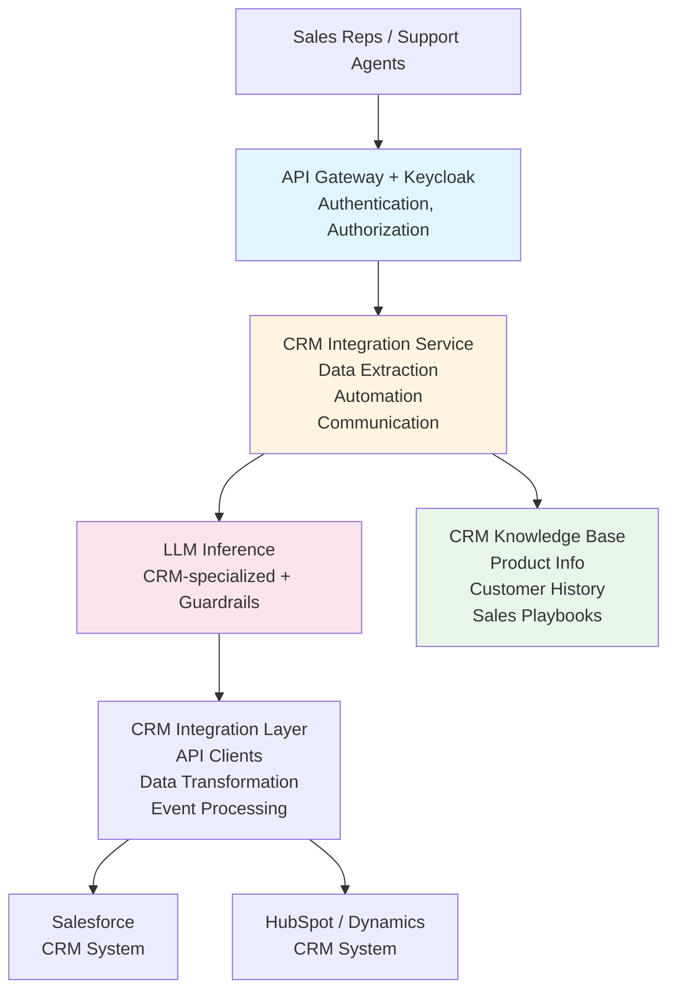

# CRM Integration with LLM

A reference architecture for integrating LLM capabilities with Customer Relationship Management (CRM) systems to enable intelligent customer interactions, automated data entry, and predictive analytics.

## TL;DR

Want to automate CRM data entry and make your sales team more productive? This architecture shows you how to connect LLMs to your CRM (Salesforce, HubSpot, Dynamics) to extract data from emails, score leads, and generate personalized communications. Expect 3-5 months implementation with 2-4 engineers.

**Quick Assessment**:
- **Complexity**: ⭐⭐⭐ (3/5) - Moderate complexity, requires CRM API knowledge
- **Time to Deploy**: 3-5 months for full implementation
- **Team Size**: 2-4 engineers (Backend Developer, ML Engineer, CRM Admin)
- **Cost Estimate**: $50K-$150K first year (infrastructure + development)
- **Minimum Maturity Level**: Level 2 (Managed)

**Before You Start**:
- [ ] Do you have a CRM system with API access?
- [ ] Is your CRM data clean and well-structured?
- [ ] Do you have defined lead scoring criteria?
- [ ] Can you commit to 3+ month implementation timeline?

**When NOT to Use This Architecture**:
- Small CRM (< 1000 contacts) - automation might not be worth it
- No API access - you need programmatic access to CRM
- Unclean data - fix data quality first
- No clear use cases - automation for automation's sake wastes money

## Overview

This architecture shows you how to connect LLM services to your existing CRM systems (Salesforce, HubSpot, Microsoft Dynamics, etc.) in a way that actually helps your sales team. We enable natural language interactions, automated data extraction from emails and calls, intelligent lead scoring, and personalized customer communications - all while keeping your data secure and compliant.

## Business Value

- **Efficiency**: Automate routine CRM tasks and data entry
- **Personalization**: Generate personalized customer communications
- **Insights**: Extract insights from customer interactions
- **Productivity**: Reduce time spent on manual data entry
- **Customer Experience**: Improve customer experience with faster responses

## Architecture Components

### 1. CRM System Integration

#### Supported CRM Systems
- **Salesforce**: Enterprise CRM platform
- **HubSpot**: Marketing and sales CRM
- **Microsoft Dynamics 365**: Enterprise CRM solution
- **Zoho CRM**: Cloud-based CRM
- **Pipedrive**: Sales-focused CRM
- **Custom CRM**: Integration with custom CRM systems

#### Integration Methods
- **REST APIs**: Standard REST API integration
- **GraphQL APIs**: GraphQL-based integration (where available)
- **Webhooks**: Real-time event notifications
- **Bulk APIs**: Bulk data operations

### 2. Data Extraction & Processing

#### Contact & Lead Management
- **Contact Extraction**: Extract contact information from various sources
- **Lead Enrichment**: Enrich leads with additional data
- **Duplicate Detection**: Identify and merge duplicate records
- **Data Validation**: Validate and clean CRM data

#### Interaction Processing
- **Email Processing**: Extract information from emails
- **Call Transcription**: Process call transcripts
- **Meeting Notes**: Extract action items from meeting notes
- **Document Processing**: Extract data from documents

### 3. LLM Layer

#### Specialized Models
- **CRM Model**: Fine-tuned for CRM-specific tasks
- **Email Generation**: Generate personalized emails
- **Data Extraction Model**: Extract structured data from unstructured text
- **Sentiment Analysis**: Analyze customer sentiment

#### CRM Knowledge Base
- **Product Information**: Product catalogs and specifications
- **Customer History**: Historical customer interactions
- **Sales Playbooks**: Sales processes and best practices
- **Support Knowledge**: Support articles and solutions

### 4. Intelligent Automation

#### Automated Data Entry
- **Contact Creation**: Automatically create contacts from emails
- **Opportunity Creation**: Create opportunities from interactions
- **Case Creation**: Create support cases from customer inquiries
- **Activity Logging**: Automatically log activities

#### Lead Scoring & Qualification
- **Lead Scoring**: Score leads based on various factors
- **Qualification**: Qualify leads automatically
- **Routing**: Route leads to appropriate sales reps
- **Prioritization**: Prioritize leads based on scoring

### 5. Communication & Engagement

#### Email Generation
- **Personalized Emails**: Generate personalized email content
- **Follow-up Emails**: Automatically generate follow-up emails
- **Proposal Generation**: Generate proposals and quotes
- **Email Templates**: Use templates with personalization

#### Chat & Messaging
- **Chatbot Integration**: Integrate with CRM chatbot
- **Message Generation**: Generate responses to customer messages
- **Context Awareness**: Maintain context across conversations
- **Multi-channel Support**: Support multiple communication channels

### 6. Analytics & Insights

#### Customer Insights
- **Customer Segmentation**: Segment customers using LLM
- **Churn Prediction**: Predict customer churn
- **Upsell Opportunities**: Identify upsell opportunities
- **Customer Health Scoring**: Score customer health

#### Sales Analytics
- **Pipeline Analysis**: Analyze sales pipeline
- **Forecasting**: Generate sales forecasts
- **Performance Analysis**: Analyze sales performance
- **Trend Analysis**: Identify sales trends

### 7. Security & Compliance

#### Data Protection
- **PII Protection**: Protect personally identifiable information
- **Data Encryption**: Encrypt sensitive CRM data
- **Access Control**: Control access to CRM data
- **Audit Logging**: Comprehensive audit logging

#### Compliance
- **GDPR Compliance**: Ensure GDPR compliance
- **Data Retention**: Manage data retention policies
- **Consent Management**: Manage customer consent
- **Right to Deletion**: Support data deletion requests

## Architecture Diagram



## Implementation Details

### Data Extraction from Emails

```python
# Pseudo-code for email data extraction
class CRMDataExtraction:
    def extract_from_email(self, email: Email):
        # Extract structured data using LLM
        extracted_data = self.llm.extract(
            text=email.body,
            schema={
                'contact_name': str,
                'company': str,
                'email': str,
                'phone': str,
                'interest': str,
                'next_action': str
            }
        )
        
        # Validate extracted data
        validated_data = self.validate(extracted_data)
        
        # Create/update CRM records
        if validated_data.get('contact_name'):
            contact = self.crm.create_or_update_contact(validated_data)
            if validated_data.get('interest'):
                opportunity = self.crm.create_opportunity(
                    contact=contact,
                    description=validated_data['interest']
                )
        
        return validated_data
```

### Automated Lead Scoring

```python
# Pseudo-code for lead scoring
class LeadScoring:
    def score_lead(self, lead: Lead):
        # Gather lead information
        lead_data = {
            'company_info': lead.company,
            'job_title': lead.job_title,
            'industry': lead.industry,
            'website_activity': lead.website_activity,
            'email_interactions': lead.email_interactions,
            'social_signals': lead.social_signals
        }
        
        # Score using LLM
        score = self.llm.score_lead(
            lead_data=lead_data,
            criteria=self.get_scoring_criteria()
        )
        
        # Update lead in CRM
        self.crm.update_lead(lead.id, {'score': score})
        
        # Route based on score
        if score > self.high_score_threshold:
            self.route_to_sales(lead)
        elif score > self.medium_score_threshold:
            self.route_to_nurture(lead)
        
        return score
```

## Security Considerations

### Access Control
- **Role-Based Access**: Respect CRM role-based access controls
- **Field-Level Security**: Enforce field-level security
- **Record-Level Security**: Apply record-level security
- **API Security**: Secure API access with tokens and certificates

### Data Protection
- **Data Encryption**: Encrypt sensitive data
- **PII Handling**: Properly handle PII
- **Data Masking**: Mask sensitive data in non-production
- **Audit Logging**: Log all CRM operations

### Compliance
- **GDPR**: Ensure GDPR compliance
- **Data Retention**: Manage data retention
- **Consent Management**: Track and manage consent
- **Right to Deletion**: Support data deletion

## Example Use Cases

### Automated Contact Creation
**Scenario**: Email received from new contact

**System**:
- Extracts contact information from email
- Validates and enriches data
- Creates contact in CRM
- Creates opportunity if interest expressed
- Sends welcome email

### Lead Qualification
**Scenario**: New lead submitted through website

**System**:
- Extracts lead information
- Scores lead using multiple factors
- Qualifies lead based on criteria
- Routes to appropriate sales rep
- Sends personalized follow-up

### Email Generation
**Scenario**: Sales rep needs to send follow-up email

**System**:
- Analyzes customer history
- Generates personalized email content
- Includes relevant product information
- Suggests optimal send time
- Tracks email engagement

### Opportunity Analysis
**Scenario**: Analyze sales pipeline

**System**:
- Analyzes all opportunities
- Identifies at-risk opportunities
- Suggests next actions
- Generates pipeline report
- Provides forecasting insights

## Monitoring & Observability

### Key Metrics
- Data extraction accuracy
- Automation success rate
- Lead scoring accuracy
- Email engagement rates
- CRM operation latency
- Error rates

### Alerts
- CRM integration failures
- Data quality issues
- High error rates
- Performance degradation
- Security violations

### Logging
- All CRM operations
- Data extraction events
- Automation triggers
- User interactions
- Error events

## Integration Patterns

### Real-Time Integration
- Webhook-based real-time updates
- Event-driven architecture
- Immediate data synchronization

### Batch Integration
- Scheduled batch processing
- Bulk data operations
- ETL-like workflows

### Hybrid Integration
- Real-time for critical operations
- Batch for bulk operations
- Optimized for performance

## Security and Compliance Recommendations

### Organization Size and Maturity

**SMB (50-500 employees)**: ⚠️ Limited - CRM data is sensitive, requires basic security minimum
**Mid-Market (500-5,000)**: ✅ Recommended with standard security (MFA, encryption, audit logs)
**Large Enterprise (5,000+)**: ✅ Highly recommended with full security (zero-trust, SIEM, DLP)
**Regulated Industries**: ✅ Required with enhanced security (24/7 SOC, compliance automation)

### Security Maturity Requirements

- **Level 2+**: Minimum for basic CRM integration
- **Level 3+**: Recommended for production use
- **Level 4+**: Required for sensitive customer data
- **Level 5**: Required for regulated industries (healthcare, finance)

### Data Classification Support

- **Internal**: Mid-Market+, maturity level 2+ (non-PII CRM data)
- **Confidential**: Large Enterprise, maturity level 3+ (customer data)
- **Restricted**: Regulated industries, maturity level 4+ (PHI, financial data)

### Critical Security Controls

1. **PII Protection**: Customer data is highly sensitive - implement DLP
2. **Access Control**: Strict RBAC + ABAC for customer data access
3. **Audit Logging**: All customer data access must be logged
4. **Data Encryption**: Encrypt customer data at rest and in transit
5. **Consent Management**: Track and manage customer consent (GDPR/CCPA)

### Compliance Considerations

- **GDPR**: Required for EU customers - consent, right to deletion, data portability
- **CCPA**: Required for California customers - consumer rights, disclosure
- **HIPAA**: Required if processing PHI - enhanced encryption, audit logs
- **PCI-DSS**: Required if processing payment data - network segmentation, encryption

## Common Issues and Solutions

Here's what usually goes wrong with CRM integrations:

### Data Extraction Errors

**Symptoms**: LLM extracts wrong data from emails, creates incorrect CRM records

**Common Causes**:
- Email format variations (LLM confused by formatting)
- Ambiguous information (multiple possible interpretations)
- Missing context (email doesn't have all needed info)

**Solutions**:
1. **Provide context**: Include customer history in prompt context
2. **Validate extracted data**: Check against CRM data before creating records
3. **Human review**: For critical data, require human approval before creating
4. **Improve prompts**: Add examples of correct extraction in prompt
5. **Fallback to forms**: If extraction fails, present form to user

**Example Validation**:
```python
def validate_extracted_contact(data):
    # Check required fields
    if not data.get('email') or not data.get('name'):
        return False, "Missing required fields"
    
    # Validate email format
    if not is_valid_email(data['email']):
        return False, "Invalid email format"
    
    # Check for duplicates
    if contact_exists(data['email']):
        return False, "Contact already exists"
    
    return True, "Valid"
```

### CRM API Rate Limits

**Symptoms**: Integration fails, "rate limit exceeded" errors

**Common Causes**:
- Too many API calls
- Bulk operations without batching
- No rate limit handling

**Solutions**:
1. **Implement rate limiting**: Respect CRM API limits (Salesforce: 15000/day)
2. **Batch operations**: Group multiple operations into batches
3. **Use bulk APIs**: Use bulk APIs for large operations
4. **Cache responses**: Cache CRM data to reduce API calls
5. **Queue operations**: Queue operations and process with rate limiting

### Lead Scoring Inaccuracy

**Symptoms**: Lead scores don't match sales team expectations, poor lead quality

**Common Causes**:
- Scoring criteria not well-defined
- LLM doesn't understand scoring rules
- Insufficient training data

**Solutions**:
1. **Define clear criteria**: Document scoring rules explicitly
2. **Provide examples**: Give LLM examples of high/low scoring leads
3. **Human feedback loop**: Let sales team rate leads, use for fine-tuning
4. **A/B test scoring**: Test different scoring approaches
5. **Regular review**: Review scoring accuracy monthly, adjust as needed

### Duplicate Records

**Symptoms**: Multiple records for same contact, data quality issues

**Common Causes**:
- No duplicate detection
- Name variations (John Smith vs J. Smith)
- Email variations (john@company.com vs john.smith@company.com)

**Solutions**:
1. **Fuzzy matching**: Use similarity matching for names/emails
2. **Deduplication service**: Implement deduplication before creating records
3. **Merge strategy**: Define how to merge duplicate records
4. **Regular cleanup**: Run deduplication jobs regularly

## Related Documents

- [On-Premise LLM Infrastructure](./on-premise-llm-infrastructure.md)
- [Customer Support Automation](./customer-support-automation.md)
- [Threat Model](./threat-model.md)
- [Cybersecurity Framework](../cybersecurity-framework.md)

## Tools & Technologies

- **LLM Serving**: vLLM or TensorRT-LLM
- **RAG Framework**: LangChain or LlamaIndex
- **Vector DB**: Milvus (for CRM knowledge base)
- **CRM APIs**: Salesforce, HubSpot, Dynamics APIs
- **Authentication**: Keycloak
- **Monitoring**: Prometheus, Grafana

