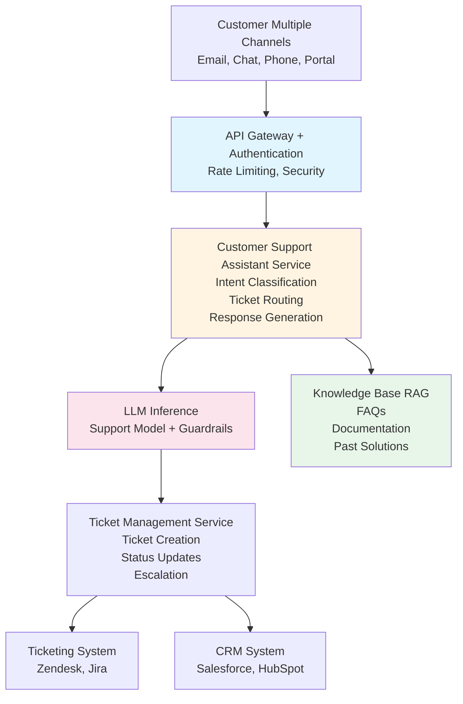

# Customer Support Automation

A reference architecture for an LLM-powered customer support system that provides automated responses, ticket routing, knowledge base search, and escalation management while maintaining high quality and security standards.

## Overview

This architecture provides an intelligent customer support system that automates common support tasks, routes tickets intelligently, provides instant answers from knowledge bases, and escalates complex issues to human agents. The system integrates with ticketing systems, knowledge bases, and CRM platforms.

## Business Value

- **Efficiency**: Reduce response time and handle more tickets
- **Cost Reduction**: Automate routine support tasks
- **Consistency**: Provide consistent, accurate responses
- **Scalability**: Handle peak loads without additional staff
- **Customer Satisfaction**: Faster resolution times

## Architecture Components

### 1. Ticket Management Integration

#### Ticketing Systems
- **Zendesk**: Enterprise ticketing platform
- **ServiceNow**: IT service management
- **Jira Service Management**: Service desk platform
- **Custom Systems**: Integration with custom ticketing systems

#### Ticket Processing
- **Ticket Ingestion**: Receive tickets from multiple channels
- **Ticket Classification**: Classify tickets by type and priority
- **Ticket Routing**: Route to appropriate agent or automation
- **Status Updates**: Update ticket status automatically

### 2. Knowledge Base Integration

#### Knowledge Sources
- **Internal KB**: Company knowledge base
- **Documentation**: Product documentation, FAQs
- **Confluence**: Internal documentation
- **Past Tickets**: Historical ticket resolutions
- **Community Forums**: Community knowledge

#### Knowledge Management
- **Vector Search**: Semantic search across knowledge base
- **Content Indexing**: Index and update knowledge content
- **Relevance Ranking**: Rank search results by relevance
- **Content Validation**: Ensure knowledge base accuracy

### 3. LLM Layer

#### Specialized Models
- **Support Model**: Fine-tuned for customer support
- **Sentiment Analysis**: Analyze customer sentiment
- **Intent Classification**: Classify customer intent
- **Response Generation**: Generate helpful responses

#### Support Knowledge Base
- **FAQ Database**: Frequently asked questions
- **Solution Database**: Past solutions and resolutions
- **Product Information**: Product details and specifications
- **Policy Database**: Company policies and procedures

### 4. Conversation Management

#### Multi-Turn Conversations
- **Context Management**: Maintain conversation context
- **Clarification**: Ask clarifying questions when needed
- **Progressive Disclosure**: Provide information progressively
- **Conversation History**: Track conversation history

#### Response Generation
- **Template-Based**: Use templates for common responses
- **Dynamic Generation**: Generate custom responses
- **Personalization**: Personalize responses based on customer
- **Tone Management**: Maintain appropriate tone

### 5. Escalation & Routing

#### Intelligent Routing
- **Skill-Based Routing**: Route based on required skills
- **Load Balancing**: Distribute tickets evenly
- **Priority Routing**: Route high-priority tickets first
- **Language Routing**: Route to language-appropriate agents

#### Escalation Logic
- **Complexity Detection**: Detect when human intervention needed
- **Sentiment-Based**: Escalate based on customer sentiment
- **SLA-Based**: Escalate based on SLA requirements
- **Manual Escalation**: Allow manual escalation

### 6. Quality Assurance

#### Response Quality
- **Accuracy Checking**: Verify response accuracy
- **Relevance Scoring**: Score response relevance
- **Tone Checking**: Ensure appropriate tone
- **Completeness**: Ensure complete responses

#### Continuous Improvement
- **Feedback Collection**: Collect customer feedback
- **Response Analysis**: Analyze response effectiveness
- **Model Fine-Tuning**: Improve models based on feedback
- **A/B Testing**: Test different response strategies

### 7. Security & Compliance

#### Data Protection
- **PII Protection**: Protect customer PII
- **Data Encryption**: Encrypt sensitive data
- **Access Control**: Control access to customer data
- **Audit Logging**: Log all customer interactions

#### Compliance
- **GDPR Compliance**: Ensure GDPR compliance
- **Data Retention**: Manage data retention policies
- **Right to Deletion**: Support data deletion requests
- **Consent Management**: Manage customer consent

## Architecture Diagram



## Implementation Details

### Ticket Processing Flow

```python
# Pseudo-code for ticket processing
class CustomerSupportAssistant:
    def process_ticket(self, ticket: Ticket, customer: Customer):
        # Classify ticket
        intent = self.classify_intent(ticket.content)
        priority = self.determine_priority(ticket, customer)
        
        # Search knowledge base
        relevant_knowledge = self.search_knowledge_base(
            query=ticket.content,
            customer_context=customer
        )
        
        # Generate response
        response = self.generate_response(
            ticket=ticket,
            intent=intent,
            knowledge=relevant_knowledge,
            customer=customer
        )
        
        # Quality check
        quality_score = self.assess_quality(response, ticket)
        
        # Route or respond
        if quality_score > threshold and intent != 'complex':
            return self.auto_respond(ticket, response)
        else:
            return self.escalate_to_agent(ticket, response, intent)
```

### Response Generation

The system generates responses using:

1. **Intent Classification**: Understand customer intent
2. **Knowledge Retrieval**: Retrieve relevant knowledge
3. **Context Assembly**: Assemble response context
4. **Response Generation**: Generate natural language response
5. **Quality Check**: Verify response quality
6. **Personalization**: Personalize for customer
7. **Tone Adjustment**: Adjust tone based on sentiment

### Escalation Logic

- **Complexity Detection**: Detect complex issues requiring human help
- **Sentiment Analysis**: Escalate negative sentiment
- **SLA Monitoring**: Escalate based on SLA requirements
- **Confidence Scoring**: Escalate low-confidence responses
- **Customer Request**: Allow customer to request human agent

## Security Considerations

### Data Protection
- **PII Handling**: Protect customer PII
- **Data Encryption**: Encrypt customer data
- **Access Control**: Restrict access to customer data
- **Data Retention**: Manage data retention

### Compliance
- **GDPR**: Ensure GDPR compliance
- **CCPA**: California Consumer Privacy Act compliance
- **PCI DSS**: If handling payment information
- **Industry Regulations**: Industry-specific compliance

### Security Measures
- **Rate Limiting**: Prevent abuse
- **Input Validation**: Validate all inputs
- **Output Filtering**: Filter sensitive information
- **Audit Logging**: Comprehensive audit trails

## Example Use Cases

### Automated Response
**Customer**: "I forgot my password, how do I reset it?"

**Assistant**: 
- Identifies password reset request
- Retrieves password reset instructions
- Generates helpful response with steps
- Provides link to reset page
- Auto-responds to customer

### Ticket Routing
**Customer**: "I'm having issues with payment processing"

**Assistant**:
- Classifies as payment issue
- Routes to payment support team
- Provides initial response
- Escalates to specialized agent

### Knowledge Base Search
**Customer**: "How do I upgrade my subscription?"

**Assistant**:
- Searches knowledge base
- Finds relevant documentation
- Generates response with steps
- Provides links to relevant pages

### Escalation
**Customer**: Complex technical issue requiring investigation

**Assistant**:
- Detects complexity
- Gathers initial information
- Creates detailed ticket
- Escalates to technical team
- Notifies customer of escalation

## Monitoring & Observability

### Key Metrics
- Response time
- Resolution rate
- Customer satisfaction
- Escalation rate
- First contact resolution
- Average handling time

### Alerts
- High response times
- Low satisfaction scores
- High escalation rates
- System errors
- SLA violations

### Logging
- All customer interactions
- Ticket processing events
- Response quality scores
- Escalation events
- Customer feedback

## Integration Points

### Ticketing Systems
- Zendesk API
- ServiceNow API
- Jira Service Management API
- Custom ticketing APIs

### CRM Systems
- Salesforce integration
- HubSpot integration
- Microsoft Dynamics integration

### Communication Channels
- Email integration
- Chat integration (Slack, Teams)
- Phone integration (Twilio)
- Web portal integration

## Performance Targets

- **Response Time**: < 2 seconds for automated responses
- **Ticket Processing**: < 5 seconds for ticket classification
- **Concurrent Users**: Support 1000+ concurrent customers
- **Uptime**: 99.9% availability

## Advanced Features

### Multi-Channel Support
- Unified experience across channels
- Context preservation across channels
- Channel-specific optimizations

### Proactive Support
- Identify at-risk customers
- Proactive outreach
- Preventive support

### Analytics & Insights
- Support analytics dashboard
- Trend analysis
- Predictive analytics
- Customer insights

## Security and Compliance Recommendations

### Organization Size and Maturity

**SMB (50-500 employees)**: ✅ Suitable with basic security (SSO, RBAC, TLS, PII protection)
**Mid-Market (500-5,000)**: ✅ Recommended with standard security (MFA, encryption, DLP, audit logs)
**Large Enterprise (5,000+)**: ✅ Highly recommended with full security (zero-trust, SIEM, advanced DLP)
**Regulated Industries**: ✅ Required with enhanced security (24/7 SOC, compliance automation, GDPR/CCPA)

### Security Maturity Requirements

- **Level 2+**: Minimum for basic customer support
- **Level 3+**: Recommended for production use
- **Level 4+**: Required for sensitive customer data
- **Level 5**: Required for regulated industries (healthcare, finance)

### Data Classification Support

- **Internal**: SMB+, maturity level 2+ (non-PII support data)
- **Confidential**: Mid-Market+, maturity level 3+ (customer data)
- **Restricted**: Large Enterprise, maturity level 4+ (sensitive customer data, PHI)

### Critical Security Controls

1. **PII Protection**: Customer data is highly sensitive - implement DLP and redaction
2. **Access Control**: Strict RBAC for customer data access
3. **Audit Logging**: All customer interactions must be logged
4. **Data Encryption**: Encrypt customer data at rest and in transit
5. **Consent Management**: Track and manage customer consent (GDPR/CCPA)
6. **Data Retention**: Manage data retention per compliance requirements

### Compliance Considerations

- **GDPR**: Required for EU customers - consent, right to deletion, data portability
- **CCPA**: Required for California customers - consumer rights, disclosure
- **HIPAA**: Required if processing PHI - enhanced encryption, audit logs
- **PCI-DSS**: Required if processing payment data - network segmentation, encryption

## Related Documents

- [On-Premise LLM Infrastructure](./on-premise-llm-infrastructure.md)
- [Confluence Document Search](./confluence-document-search.md)
- [Threat Model](./threat-model.md)
- [Cybersecurity Framework](../cybersecurity-framework.md)

## Tools & Technologies

- **LLM Serving**: vLLM or TensorRT-LLM
- **RAG Framework**: LangChain or LlamaIndex
- **Vector DB**: Milvus (for knowledge base)
- **Ticketing Integration**: Zendesk, ServiceNow APIs
- **CRM Integration**: Salesforce, HubSpot APIs
- **Authentication**: Keycloak
- **Monitoring**: Prometheus, Grafana

