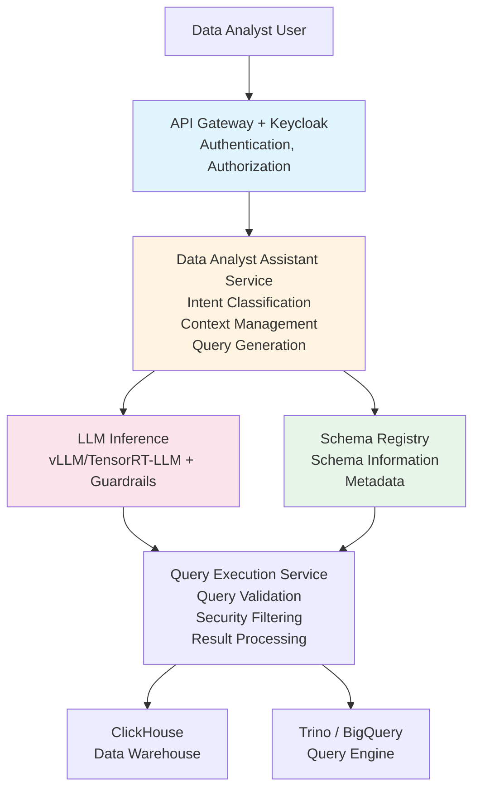

# Data Analyst Assistant

A reference architecture for an LLM-powered assistant that helps data analysts write SQL queries, understand data schemas, generate visualizations, and analyze data from enterprise data warehouses.

## TL;DR

Tired of analysts asking "how do I write this SQL query?" This architecture gives them an AI assistant that converts natural language to SQL, explains results, and suggests optimizations. Analysts ask questions in plain English, get SQL queries, execute them safely, and see results. Expect 2-4 months implementation with 2-3 engineers.

**Quick Assessment**:
- **Complexity**: ⭐⭐⭐ (3/5) - Moderate complexity, requires DWH and LLM knowledge
- **Time to Deploy**: 2-4 months for full implementation
- **Team Size**: 2-3 engineers (Data Engineer, ML Engineer, Backend Developer)
- **Cost Estimate**: $30K-$100K first year (infrastructure + development)
- **Minimum Maturity Level**: Level 2 (Managed)

**Before You Start**:
- [ ] Do you have a data warehouse with documented schema?
- [ ] Are data access policies well-defined?
- [ ] Do analysts need help with SQL (or is this nice-to-have)?
- [ ] Can you commit to 2+ month implementation timeline?

**When NOT to Use This Architecture**:
- All analysts are SQL experts - might not be worth the effort
- No data warehouse - build that first
- Schema changes daily - too unstable for reliable SQL generation
- No data governance - you'll create a security nightmare

## Overview

This architecture gives you a conversational AI assistant that helps data analysts interact with data warehouses (ClickHouse, Trino, BigQuery, etc.) through natural language. Analysts can ask questions in plain English, the system generates SQL queries, executes them safely, and returns formatted results. We've built in security and governance from the start - no shortcuts that'll cause problems later.

## Business Value

- **Productivity**: Reduce time to write complex SQL queries
- **Accessibility**: Enable non-technical users to query data
- **Quality**: Generate optimized, secure queries
- **Learning**: Help analysts learn SQL and data patterns
- **Governance**: Enforce data access policies and query limits

## Architecture Components

### 1. Query Generation Layer

#### Text-to-SQL Engine
- **Schema Understanding**: Maintain up-to-date schema information
- **Query Generation**: Convert natural language to SQL
- **Query Validation**: Validate SQL syntax and safety
- **Query Optimization**: Suggest query optimizations

#### Schema Management
- **Schema Registry**: Centralized schema information
- **Schema Updates**: Automatic schema sync from data warehouse
- **Metadata Enrichment**: Column descriptions, data types, relationships
- **Access Control**: Schema visibility based on user permissions

### 2. Data Warehouse Integration

#### Supported Warehouses
- **ClickHouse**: High-performance columnar database
- **Trino**: Distributed SQL query engine
- **PostgreSQL**: Traditional relational database
- **BigQuery**: Cloud data warehouse (if applicable)

#### Connection Management
- **Connection Pooling**: Efficient connection management
- **Query Routing**: Route queries to appropriate warehouse
- **Result Caching**: Cache query results for performance
- **Query Limits**: Enforce resource limits per user/tenant

### 3. LLM Layer

#### Model Selection
- **Code Generation Model**: Fine-tuned for SQL generation
- **Explanation Model**: Generate human-readable explanations
- **Embedding Model**: For schema and query similarity search

#### Query Processing
- **Intent Classification**: Understand user intent (query, explain, visualize)
- **Context Assembly**: Include relevant schema information
- **Multi-Turn Conversations**: Maintain conversation context
- **Error Handling**: Provide helpful error messages

### 4. Security & Access Control

#### Authentication & Authorization
- **Keycloak Integration**: SSO with enterprise directory
- **Role-Based Access**: Map AD groups to data access roles
- **Query-Level Security**: Filter queries based on user permissions
- **Row-Level Security**: Apply RLS policies to queries

#### Query Safety
- **SQL Injection Prevention**: Sanitize and validate queries
- **Resource Limits**: Limit query execution time and resources
- **Sensitive Data Detection**: Identify and protect sensitive columns
- **Audit Logging**: Log all queries and results

### 5. Visualization & Reporting

#### Visualization Generation
- **Chart Type Detection**: Suggest appropriate chart types
- **Code Generation**: Generate visualization code (Python, R, JavaScript)
- **Interactive Dashboards**: Create interactive visualizations
- **Export Capabilities**: Export to various formats

#### Report Generation
- **Automated Reports**: Generate scheduled reports
- **Report Templates**: Reusable report templates
- **Data Summarization**: Summarize query results
- **Insight Extraction**: Identify key insights from data

### 6. Learning & Assistance

#### Query Explanation
- **SQL Explanation**: Explain how SQL queries work
- **Result Interpretation**: Help interpret query results
- **Performance Analysis**: Explain query performance
- **Optimization Suggestions**: Suggest query improvements

#### Documentation
- **Schema Documentation**: Auto-generated schema docs
- **Query Examples**: Example queries for common patterns
- **Best Practices**: SQL and data analysis best practices
- **Tutorials**: Interactive learning tutorials

## Architecture Diagram



## Implementation Details

### Text-to-SQL Generation

```python
# Pseudo-code for text-to-SQL generation
class DataAnalystAssistant:
    def generate_sql(self, user_query: str, user: User, context: ConversationContext):
        # Get relevant schema information
        schema_info = self.get_relevant_schema(user_query, user)
        
        # Build prompt with schema context
        prompt = self.build_sql_prompt(
            user_query=user_query,
            schema=schema_info,
            conversation_history=context.history,
            user_permissions=user.permissions
        )
        
        # Generate SQL using LLM
        sql_query = self.llm.generate(prompt)
        
        # Validate and sanitize SQL
        validated_sql = self.validate_and_sanitize(sql_query, user)
        
        # Apply security filters
        secured_sql = self.apply_security_filters(validated_sql, user)
        
        return secured_sql
```

### Schema-Aware Query Generation

The system maintains a vector database of schema information:

- **Table Descriptions**: Natural language descriptions of tables
- **Column Metadata**: Column names, types, descriptions, examples
- **Relationships**: Foreign key relationships
- **Common Patterns**: Frequently used query patterns
- **Access Permissions**: Which users can access which tables/columns

### Query Execution Flow

1. **User Query**: "Show me sales by region for last quarter"
2. **Intent Classification**: Identify as data query request
3. **Schema Retrieval**: Retrieve relevant schema information
4. **SQL Generation**: Generate SQL query with LLM
5. **Validation**: Validate SQL syntax and safety
6. **Security Filtering**: Apply access control filters
7. **Execution**: Execute query on data warehouse
8. **Result Processing**: Format and summarize results
9. **Visualization**: Suggest or generate visualizations
10. **Response**: Return results with explanation

## Security Considerations

### Access Control
- **Table-Level Access**: Restrict access to specific tables
- **Column-Level Access**: Mask sensitive columns
- **Row-Level Security**: Apply RLS policies
- **Query Limits**: Limit query complexity and execution time

### Data Protection
- **Query Logging**: Log all queries for audit
- **Result Filtering**: Filter sensitive data from results
- **PII Detection**: Identify and protect PII
- **Encryption**: Encrypt data in transit and at rest

### Query Safety
- **SQL Injection Prevention**: Parameterized queries only
- **Read-Only Mode**: Prevent write operations
- **Resource Limits**: CPU, memory, and time limits
- **Query Validation**: Validate against allowed patterns

## Example Interactions

### Query Generation
**User**: "What were the top 10 products by revenue in Q4?"

**Assistant**: 
```sql
SELECT 
    product_name,
    SUM(revenue) as total_revenue
FROM sales
WHERE 
    quarter = 'Q4' 
    AND year = 2024
GROUP BY product_name
ORDER BY total_revenue DESC
LIMIT 10;
```

**Explanation**: "This query aggregates sales data by product for Q4 2024, summing revenue and returning the top 10 products."

### Query Optimization
**User**: "This query is slow, how can I optimize it?"

**Assistant**: Analyzes the query and suggests:
- Add indexes on filtered columns
- Use partitioning for time-based queries
- Consider materialized views for frequent aggregations
- Rewrite subqueries as JOINs

### Data Exploration
**User**: "What columns are available in the sales table?"

**Assistant**: Lists all columns with descriptions:
- `sale_id` (UUID): Unique identifier for each sale
- `product_id` (INT): Reference to product
- `customer_id` (INT): Reference to customer
- `sale_date` (DATE): Date of sale
- `revenue` (DECIMAL): Sale amount
- ...

## Monitoring & Observability

### Key Metrics
- Query generation latency
- SQL accuracy rate
- Query execution time
- User satisfaction
- Error rates

### Alerts
- High query generation latency
- SQL syntax errors
- Security violations
- Resource limit exceedances

### Logging
- All user queries
- Generated SQL queries
- Query execution results
- User feedback

## Integration Points

### Data Warehouses
- ClickHouse REST API or native client
- Trino JDBC/HTTP API
- PostgreSQL connection
- BigQuery API (if applicable)

### Authentication
- Keycloak for SSO
- Active Directory integration
- Service account management

### Visualization Tools
- Integration with Grafana
- Export to Jupyter notebooks
- Integration with BI tools (Tableau, Power BI)

## Performance Targets

- **Query Generation**: < 3 seconds (P95)
- **Query Execution**: Depends on warehouse, but < 30 seconds for typical queries
- **Concurrent Users**: Support 50+ concurrent analysts
- **Schema Sync**: < 5 minutes from schema change

## Advanced Features

### Multi-Turn Conversations
- Maintain context across multiple queries
- Reference previous results
- Refine queries based on results

### Query Templates
- Pre-built query templates for common patterns
- Parameterized templates
- Template library management

### Collaborative Features
- Share queries with team
- Query versioning
- Query comments and annotations

## Security and Compliance Recommendations

### Organization Size and Maturity

**SMB (50-500 employees)**: ✅ Suitable with basic security (SSO, RBAC, query validation)
**Mid-Market (500-5,000)**: ✅ Recommended with standard security (MFA, row-level security, audit logs)
**Large Enterprise (5,000+)**: ✅ Highly recommended with full security (zero-trust, SIEM, advanced access controls)
**Regulated Industries**: ✅ Required with enhanced security (24/7 SOC, compliance automation, data masking)

### Security Maturity Requirements

- **Level 2+**: Minimum for basic data analysis
- **Level 3+**: Recommended for production use
- **Level 4+**: Required for sensitive data
- **Level 5**: Required for regulated industries (healthcare, finance)

### Data Classification Support

- **Internal**: SMB+, maturity level 2+ (non-sensitive data)
- **Confidential**: Mid-Market+, maturity level 3+ (sensitive business data)
- **Restricted**: Large Enterprise, maturity level 4+ (PII, financial data)
- **Top Secret**: Regulated industries, maturity level 5 (PHI, classified data)

### Critical Security Controls

1. **Query Security**: SQL injection prevention, query validation, read-only mode
2. **Access Control**: Row-level and column-level security
3. **Audit Logging**: All queries and data access must be logged
4. **Data Masking**: Mask sensitive columns based on user permissions
5. **PII Protection**: Detect and protect PII in query results
6. **Resource Limits**: Limit query complexity and execution time

### Compliance Considerations

- **GDPR**: Required for EU data - PII protection, right to deletion
- **HIPAA**: Required if processing PHI - enhanced encryption, audit logs
- **SOC 2**: Recommended for enterprise - comprehensive audit trails
- **ISO 27001**: Recommended for large enterprises

## Common Issues and Solutions

Here's what usually goes wrong with data analyst assistants:

### Incorrect SQL Generation

**Symptoms**: LLM generates SQL that doesn't work, wrong results, syntax errors

**Common Causes**:
- Schema information incomplete or outdated
- LLM doesn't understand complex business logic
- Ambiguous user questions

**Solutions**:
1. **Keep schema up-to-date**: Automate schema sync, update daily
2. **Enrich with examples**: Provide example queries in prompt context
3. **Validate before execution**: Always validate SQL syntax
4. **Provide feedback loop**: Let users correct queries, use for improvement
5. **Use query templates**: For common patterns, use templates instead of generation

### Performance Issues

**Symptoms**: Queries take too long, DWH overloaded, timeouts

**Common Causes**:
- LLM generates inefficient SQL (no indexes, full scans)
- No query limits enforced
- Complex queries beyond DWH capabilities

**Solutions**:
1. **Add query limits**: Limit execution time, result size, complexity
2. **Query optimization**: Rewrite queries to use indexes, add hints
3. **Query timeout**: Kill queries that run too long (30s default)
4. **Rate limiting**: Prevent users from overwhelming the system
5. **Explain performance**: Show query execution plan, suggest optimizations

### Permission Issues

**Symptoms**: Users can't access data they should, or can access data they shouldn't

**Common Causes**:
- Row-level security not properly configured
- Permission mapping incorrect
- Cache showing stale permissions

**Solutions**:
1. **Test permissions thoroughly**: Create test users for each role, verify access
2. **Cache invalidation**: When permissions change, invalidate cache immediately
3. **Log all access**: Audit logs help you debug permission issues
4. **Use ABAC**: Attribute-based access control is more flexible

### Schema Sync Failures

**Symptoms**: Schema registry out of date, wrong queries generated

**Common Causes**:
- Schema discovery process failing silently
- DWH schema changes not detected
- Network issues preventing sync

**Solutions**:
1. **Monitor sync process**: Set up alerts if schema sync fails
2. **Version schemas**: Track schema versions, detect changes
3. **Manual refresh option**: Let admins manually trigger schema refresh
4. **Incremental updates**: Only sync changed tables, not everything

## Related Documents

- [On-Premise LLM Infrastructure](./on-premise-llm-infrastructure.md)
- [Financial Analyst Assistant](./financial-analyst-assistant.md)
- [Threat Model](./threat-model.md)
- [Cybersecurity Framework](../cybersecurity-framework.md)

## Tools & Technologies

- **LLM Serving**: vLLM or TensorRT-LLM
- **RAG Framework**: LangChain or LlamaIndex
- **Vector DB**: Milvus (for schema information)
- **Data Warehouses**: ClickHouse, Trino, PostgreSQL
- **Authentication**: Keycloak
- **Monitoring**: Prometheus, Grafana

