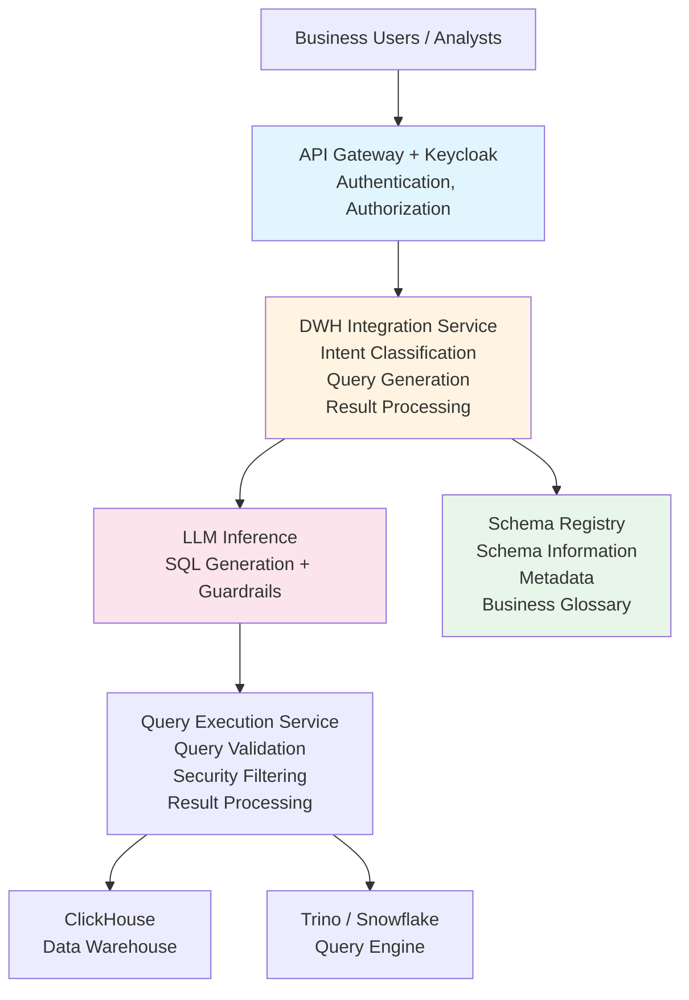

# Data Warehouse (DWH) Integration with LLM

A reference architecture for integrating LLM capabilities with enterprise data warehouses to enable natural language querying, automated reporting, and intelligent data analysis.

## TL;DR

Want to let business users query your data warehouse in plain English? This architecture shows you how to connect LLMs to your DWH (ClickHouse, Trino, Snowflake, etc.) safely and securely. Users ask questions in natural language, the system generates SQL, executes it, and returns results. Expect 3-6 months implementation with 2-5 engineers.

**Quick Assessment**:
- **Complexity**: ⭐⭐⭐ (3/5) - Moderate complexity, requires DWH and LLM knowledge
- **Time to Deploy**: 3-6 months for full implementation
- **Team Size**: 2-5 engineers (Data Engineer, ML Engineer, Backend Developer)
- **Cost Estimate**: $50K-$150K first year (infrastructure + development)
- **Minimum Maturity Level**: Level 2 (Managed)

**Before You Start**:
- [ ] Do you have a data warehouse already set up?
- [ ] Is your schema documented or can you auto-discover it?
- [ ] Do you have data access policies defined?
- [ ] Can you commit to 3+ month implementation timeline?

**When NOT to Use This Architecture**:
- No existing data warehouse - build that first
- Schema changes daily - too unstable for reliable SQL generation
- No data governance - you'll create a security nightmare
- Need real-time streaming queries - this is for batch/analytical queries

## Overview

This architecture shows you how to connect LLM services to your existing data warehouses (ClickHouse, Trino, Snowflake, BigQuery, etc.) in a way that's both powerful and secure. Users can ask questions in natural language, the system converts that to SQL, executes it safely, and returns formatted results. We've built in security and governance from the ground up - no shortcuts that'll bite you later.

## Business Value

- **Accessibility**: Enable business users to query data warehouses using natural language
- **Productivity**: Reduce time to generate complex analytical queries
- **Governance**: Enforce data access policies and query limits
- **Insights**: Automatically generate insights from data
- **Documentation**: Auto-generate data documentation and lineage

## Architecture Components

### 1. Data Warehouse Layer

#### Supported Data Warehouses
- **ClickHouse**: High-performance columnar database
- **Trino**: Distributed SQL query engine
- **Snowflake**: Cloud data warehouse
- **BigQuery**: Google Cloud data warehouse
- **Redshift**: AWS data warehouse
- **PostgreSQL**: Traditional relational database
- **Databricks**: Lakehouse platform

#### Connection Management
- **Connection Pooling**: Efficient connection management per warehouse
- **Query Routing**: Route queries to appropriate warehouse
- **Multi-Warehouse Support**: Support multiple warehouses simultaneously
- **Failover**: Automatic failover to backup warehouses

### 2. Schema Management & Discovery

#### Schema Registry
- **Schema Discovery**: Automatically discover and catalog schemas
- **Schema Versioning**: Track schema changes over time
- **Metadata Enrichment**: Add business descriptions to technical schemas
- **Relationship Mapping**: Map relationships between tables and views

#### Metadata Management
- **Column Descriptions**: Natural language descriptions of columns
- **Data Dictionary**: Comprehensive data dictionary
- **Business Glossary**: Map technical terms to business concepts
- **Data Lineage**: Track data lineage and transformations

**Recommended Tools**:
- **OpenMetadata**: Excellent choice for schema registry and metadata management. Provides automatic schema discovery, versioning, lineage tracking, and DQ test management. Integrates with major data warehouses (ClickHouse, Trino, Snowflake, BigQuery, etc.) and provides REST APIs for programmatic access.
- **DataHub**: Alternative metadata platform with similar capabilities
- **Custom Solutions**: Build custom schema registry if needed

### 3. Text-to-SQL Engine

#### Query Generation
- **Intent Classification**: Understand user intent (query, report, analysis)
- **Schema-Aware Generation**: Generate SQL using schema context
- **Query Optimization**: Optimize generated queries
- **Multi-Step Queries**: Handle complex multi-step queries

#### Query Validation
- **Syntax Validation**: Validate SQL syntax
- **Security Validation**: Check for security issues (SQL injection, etc.)
- **Performance Validation**: Estimate query performance
- **Access Control Validation**: Verify user has access to requested data

### 4. LLM Layer

#### Specialized Models
- **SQL Generation Model**: Fine-tuned for SQL generation
- **Query Explanation Model**: Explain SQL queries in natural language
- **Insight Generation Model**: Generate insights from query results
- **Documentation Model**: Generate data documentation

#### Knowledge Base
- **Query Patterns**: Common query patterns and examples
- **Business Rules**: Business rules and constraints
- **Data Quality Rules**: Data quality and validation rules
- **Best Practices**: SQL and data analysis best practices

### 5. Security & Access Control

#### Authentication & Authorization
- **SSO Integration**: Single sign-on with enterprise identity providers
- **Role-Based Access**: Map AD groups to data access roles
- **Row-Level Security**: Apply row-level security policies
- **Column-Level Security**: Mask sensitive columns based on user permissions

#### Query Security
This is critical - one bad query can expose sensitive data or bring down your DWH:

- **SQL Injection Prevention**: Sanitize and validate all queries - never trust LLM output blindly
- **Resource Limits**: Limit query execution time and resources - prevent runaway queries
- **Sensitive Data Detection**: Identify and protect sensitive data - automatically mask PII
- **Audit Logging**: Comprehensive audit logging of all queries - you'll need this for compliance and debugging

### 6. Result Processing & Visualization

#### Result Processing
- **Result Formatting**: Format query results for presentation
- **Data Aggregation**: Aggregate and summarize results
- **Anomaly Detection**: Detect anomalies in query results
- **Trend Analysis**: Identify trends in data

#### Visualization
- **Chart Generation**: Automatically generate appropriate charts
- **Dashboard Creation**: Create interactive dashboards
- **Report Generation**: Generate formatted reports
- **Export Capabilities**: Export to various formats (CSV, Excel, PDF)

## Architecture Diagram



## Implementation Details

### Schema Discovery & Indexing

```python
# Pseudo-code for schema discovery
class SchemaDiscovery:
    def discover_schema(self, warehouse: DataWarehouse):
        # Connect to warehouse
        connection = self.connect(warehouse)
        
        # Discover tables and views
        tables = connection.get_tables()
        
        for table in tables:
            # Get columns and metadata
            columns = connection.get_columns(table)
            
            # Generate embeddings for schema
            schema_embedding = self.generate_embedding(
                table_name=table.name,
                columns=columns,
                description=table.description
            )
            
            # Store in vector database
            self.schema_registry.store(
                table=table,
                embedding=schema_embedding,
                metadata={
                    'warehouse': warehouse.name,
                    'schema': table.schema,
                    'columns': columns,
                    'last_updated': datetime.now()
                }
            )
```

### Query Generation Flow

1. **User Query**: "Show me sales by region for last quarter"
2. **Intent Classification**: Identify as data query request
3. **Schema Retrieval**: Retrieve relevant schema information using vector search
4. **Context Assembly**: Assemble context with schema, business rules, examples
5. **SQL Generation**: Generate SQL query using LLM
6. **Validation**: Validate SQL syntax, security, and access
7. **Security Filtering**: Apply row-level and column-level security
8. **Execution**: Execute query on data warehouse
9. **Result Processing**: Format and analyze results
10. **Response**: Return results with explanation and visualization

## Security Considerations

### Access Control
- **Table-Level Access**: Restrict access to specific tables
- **Column-Level Access**: Mask sensitive columns
- **Row-Level Security**: Apply RLS policies based on user attributes
- **Query Limits**: Limit query complexity, execution time, and resource usage

### Data Protection
- **Query Logging**: Log all queries for audit and compliance
- **Result Filtering**: Filter sensitive data from results
- **PII Detection**: Automatically detect and protect PII
- **Encryption**: Encrypt data in transit and at rest

### Query Safety
- **SQL Injection Prevention**: Only allow parameterized queries
- **Read-Only Mode**: Prevent write operations (if required)
- **Resource Limits**: CPU, memory, and time limits per query
- **Query Validation**: Validate against allowed patterns and policies

## Integration Patterns

### Direct Integration
- Direct connection to data warehouse
- Native SQL execution
- Full feature support

### API-Based Integration
- REST API wrapper around data warehouse
- Standardized interface
- Easier to secure and monitor

### Federated Queries
- Query across multiple warehouses
- Unified interface
- Query optimization across sources

## Example Use Cases

### Natural Language Querying
**User**: "What were the top 10 products by revenue in Q4?"

**System**:
- Generates SQL query
- Executes on data warehouse
- Returns formatted results
- Provides explanation

### Automated Reporting
**User**: "Generate monthly sales report"

**System**:
- Identifies report requirements
- Generates SQL queries
- Executes queries
- Formats report
- Schedules for future runs

### Data Exploration
**User**: "What columns are available in the sales table?"

**System**:
- Retrieves schema information
- Lists columns with descriptions
- Provides examples and usage patterns

### Insight Generation
**User**: "Analyze sales trends"

**System**:
- Generates analysis queries
- Executes queries
- Analyzes results
- Generates insights and recommendations

## Monitoring & Observability

### Key Metrics
- Query generation latency
- SQL accuracy rate
- Query execution time
- User satisfaction
- Error rates
- Resource utilization

### Alerts
- High query generation latency
- SQL syntax errors
- Security violations
- Resource limit exceedances
- Data warehouse connectivity issues

### Logging
- All user queries
- Generated SQL queries
- Query execution results
- Access control decisions
- Performance metrics

## Common Issues and Solutions

Here are the problems we see most often and how to fix them:

### SQL Generation Errors

**Symptoms**: LLM generates invalid SQL, queries fail, users frustrated

**Common Causes**:
- Schema information incomplete or outdated
- LLM doesn't understand your schema structure
- Complex queries beyond model capabilities

**Solutions**:
1. **Keep schema up-to-date**: Automate schema discovery, sync daily
2. **Enrich metadata**: Add business descriptions to tables/columns - helps LLM understand context
3. **Provide examples**: Include example queries in prompt context
4. **Validate before execution**: Always validate SQL syntax before sending to DWH
5. **Use query templates**: For common patterns, use templates instead of full generation

**Example Schema Enrichment**:
```yaml
tables:
  - name: sales
    description: "Sales transactions with product, customer, and revenue information"
    columns:
      - name: product_id
        description: "Foreign key to products table"
        data_type: integer
      - name: revenue
        description: "Sale amount in USD"
        data_type: decimal
```

### Permission Issues

**Symptoms**: Users can't access data they should have access to, or can access data they shouldn't

**Common Causes**:
- Row-level security not properly configured
- Permission mapping incorrect
- Cache showing stale permissions

**Solutions**:
1. **Test permissions thoroughly**: Create test users for each role, verify access
2. **Cache invalidation**: When permissions change, invalidate cache immediately
3. **Log all access**: Audit logs help you debug permission issues
4. **Use ABAC**: Attribute-based access control is more flexible than simple RBAC

### Query Performance Problems

**Symptoms**: Queries take too long, timeouts, DWH overloaded

**Common Causes**:
- LLM generates inefficient SQL (no indexes, full table scans)
- Queries too complex
- No query limits enforced

**Solutions**:
1. **Add query limits**: Limit execution time, result size, complexity
2. **Query optimization**: Rewrite queries to use indexes, add hints
3. **Query timeout**: Kill queries that run too long (30s default, adjust per DWH)
4. **Rate limiting**: Prevent users from overwhelming the system

**Example Query Limits**:
```yaml
query_limits:
  max_execution_time: 30s
  max_result_rows: 10000
  max_query_complexity: 100  # based on your metric
  max_concurrent_queries_per_user: 3
```

### Schema Sync Failures

**Symptoms**: Schema registry out of date, wrong queries generated

**Common Causes**:
- Schema discovery process failing silently
- DWH schema changes not detected
- Network issues preventing sync

**Solutions**:
1. **Monitor sync process**: Set up alerts if schema sync fails
2. **Version schemas**: Track schema versions, detect changes
3. **Manual refresh option**: Let admins manually trigger schema refresh
4. **Incremental updates**: Only sync changed tables, not everything

## Performance Optimization

### Caching Strategies
- **Query Result Caching**: Cache frequently used query results - we've seen 10x speedup for repeated queries
- **Schema Caching**: Cache schema information - no need to fetch every time
- **Metadata Caching**: Cache metadata and business rules - reduces LLM context size

### Query Optimization
- **Query Rewriting**: Optimize generated queries - add indexes hints, fix inefficient joins
- **Index Recommendations**: Suggest indexes for better performance - help your DBA team
- **Partition Pruning**: Leverage table partitioning - queries run faster on partitioned tables

## Security and Compliance Recommendations

### Organization Size Recommendations

**Small to Medium Business (SMB) - 50-500 employees**:
- ✅ Suitable with simplified configuration
- **Security Level**: Basic to Medium
- **Required Controls**:
  - SSO integration (Keycloak)
  - Basic RBAC
  - TLS 1.3 encryption
  - Basic audit logging
  - Quarterly access reviews
- **Data Classification**: Public, Internal, Confidential
- **Compliance**: GDPR (if EU), basic data protection

**Mid-Market Enterprise - 500-5,000 employees**:
- ✅ Recommended with standard configuration
- **Security Level**: Medium to High
- **Required Controls**:
  - SSO with MFA (Keycloak, Okta)
  - Advanced RBAC
  - mTLS for internal communication
  - Comprehensive audit logging
  - Monthly access reviews
  - DLP for sensitive data
- **Data Classification**: All levels up to Restricted
- **Compliance**: GDPR, CCPA, SOC 2

**Large Enterprise - 5,000+ employees**:
- ✅ Highly recommended with full configuration
- **Security Level**: High
- **Required Controls**:
  - SSO with MFA + hardware tokens
  - Fine-grained RBAC + ABAC
  - Full mTLS with certificate pinning
  - Comprehensive audit logging + SIEM
  - Weekly access reviews
  - Advanced DLP
  - UEBA for anomaly detection
  - Zero-trust architecture
- **Data Classification**: All levels including Top Secret
- **Compliance**: GDPR, CCPA, SOC 2, ISO 27001, industry-specific

**Regulated Industries (Healthcare, Finance, Government)**:
- ✅ Required with enhanced security
- **Security Level**: Very High
- **Required Controls**:
  - All Large Enterprise controls +
  - Hardware security modules (HSM)
  - Air-gapped options for Top Secret
  - 24/7 security monitoring (SOC)
  - Real-time threat intelligence
  - Enhanced audit trails (immutable)
  - Regular penetration testing
  - Compliance automation
- **Data Classification**: All levels with enhanced controls
- **Compliance**: HIPAA (healthcare), PCI-DSS (payments), SOX (finance), FedRAMP (government)

### Security Maturity Level Recommendations

**Level 1-2 (Initial/Managed)**:
- Start with basic DWH integration
- Implement SSO and basic RBAC
- Focus on data classification
- Basic monitoring and logging
- **Not recommended for**: Restricted/Top Secret data, regulated industries

**Level 3 (Defined)**:
- Full DWH integration recommended
- Advanced RBAC and access controls
- Comprehensive monitoring
- Regular security assessments
- **Suitable for**: Most business use cases, Confidential data

**Level 4-5 (Quantitatively Managed/Optimizing)**:
- Full enterprise deployment
- Zero-trust architecture
- Advanced threat detection
- Continuous security optimization
- **Required for**: Restricted/Top Secret data, regulated industries

### Data Classification and Controls

**Public Data**:
- Basic access control
- TLS 1.3 encryption
- Basic audit logging
- Suitable for: SMB, all maturity levels

**Internal Data**:
- RBAC required
- TLS 1.3 encryption
- Comprehensive audit logging
- Suitable for: Mid-Market+, maturity level 2+

**Confidential Data**:
- Advanced RBAC + ABAC
- mTLS required
- Comprehensive audit logging + SIEM
- DLP required
- Suitable for: Large Enterprise, maturity level 3+

**Restricted Data**:
- Fine-grained RBAC + ABAC + approval workflows
- mTLS + certificate pinning
- Real-time monitoring + UEBA
- Advanced DLP
- Air-gapped options
- Suitable for: Large Enterprise, regulated industries, maturity level 4+

**Top Secret Data**:
- Maximum security controls
- Air-gapped deployment
- Hardware security modules
- 24/7 SOC monitoring
- Immutable audit logs
- Suitable for: Regulated industries, government, maturity level 5

### Compliance Requirements

**GDPR (EU Data Processing)**:
- Required for: All organizations processing EU data
- Key Controls: PII protection, consent management, right to deletion
- Implementation: Data classification, encryption, access controls, audit logging

**HIPAA (Healthcare Data)**:
- Required for: Healthcare organizations, PHI processing
- Key Controls: PHI encryption, access controls, audit logs, breach notification
- Implementation: Enhanced encryption, strict access controls, comprehensive audit trails

**PCI-DSS (Payment Card Data)**:
- Required for: Organizations processing payment cards
- Key Controls: Cardholder data protection, network segmentation, access controls
- Implementation: Network isolation, encryption, strict access controls, regular testing

**SOX (Financial Reporting)**:
- Required for: Public companies, financial institutions
- Key Controls: Financial data integrity, access controls, audit trails
- Implementation: Comprehensive logging, access reviews, change management

## Related Documents

- [On-Premise LLM Infrastructure](./on-premise-llm-infrastructure.md)
- [Data Analyst Assistant](./data-analyst-assistant.md)
- [Threat Model](./threat-model.md)
- [Cybersecurity Framework](../cybersecurity-framework.md)

## Tools & Technologies

- **LLM Serving**: vLLM or TensorRT-LLM
- **RAG Framework**: LangChain or LlamaIndex
- **Vector DB**: Milvus (for schema information)
- **Data Warehouses**: ClickHouse, Trino, Snowflake, BigQuery
- **Authentication**: Keycloak
- **Monitoring**: Prometheus, Grafana

