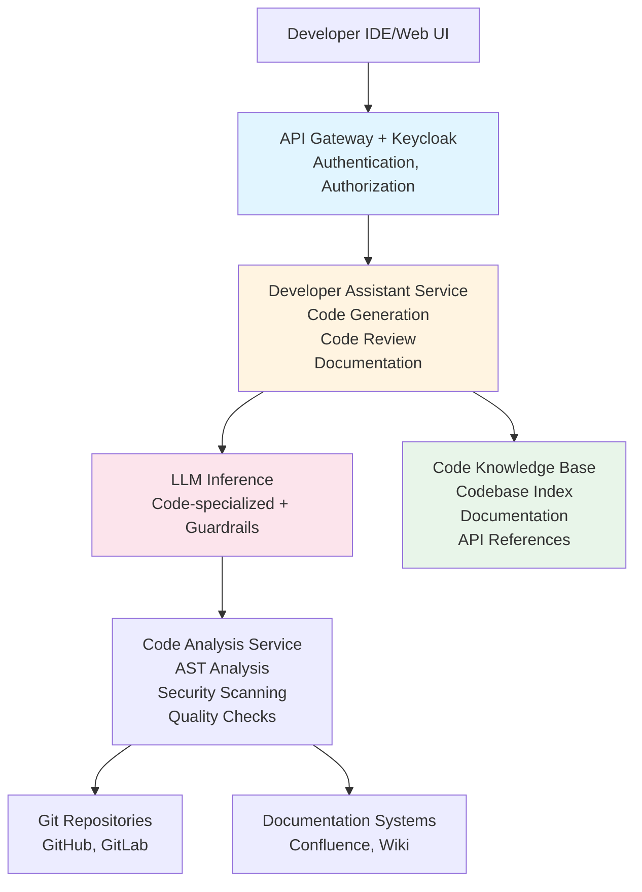

# Developer Assistant

A reference architecture for an LLM-powered assistant that helps developers with code generation, debugging, documentation, code review, and technical questions in an enterprise development environment.

## Overview

This architecture provides a specialized AI assistant for software developers that integrates with development tools, code repositories, and documentation systems. The assistant helps with code generation, debugging, code review, documentation, and answering technical questions while maintaining security and code quality standards.

## Business Value

- **Productivity**: Accelerate development with AI-assisted coding
- **Quality**: Improve code quality through automated reviews
- **Knowledge Sharing**: Make organizational knowledge accessible
- **Onboarding**: Faster onboarding for new developers
- **Consistency**: Enforce coding standards and best practices

## Architecture Components

### 1. Code Repository Integration

#### Repository Access
- **Git Integration**: Connect to Git repositories (GitHub, GitLab, Bitbucket)
- **Code Indexing**: Index codebase for semantic search
- **Change Detection**: Monitor code changes and updates
- **Branch Management**: Understand branch structure and history

#### Code Analysis
- **Code Parsing**: Parse code in multiple languages
- **AST Analysis**: Abstract Syntax Tree analysis
- **Dependency Analysis**: Understand code dependencies
- **Code Metrics**: Calculate code complexity and quality metrics

### 2. Code Generation & Assistance

#### Code Generation
- **Function Generation**: Generate functions from descriptions
- **Test Generation**: Generate unit tests for code
- **Documentation Generation**: Auto-generate code documentation
- **Refactoring Suggestions**: Suggest code improvements

#### Code Completion
- **Intelligent Autocomplete**: Context-aware code completion
- **Snippet Generation**: Generate code snippets
- **Pattern Recognition**: Recognize and suggest common patterns
- **API Usage**: Suggest correct API usage

### 3. LLM Layer

#### Specialized Models
- **Code Generation Model**: Fine-tuned for code generation
- **Code Explanation Model**: Explain code functionality
- **Code Review Model**: Review code for issues
- **Documentation Model**: Generate technical documentation

#### Code Knowledge Base
- **Codebase Index**: Vector database of codebase
- **Documentation Index**: Technical documentation and wikis
- **API Documentation**: API references and examples
- **Best Practices**: Coding standards and best practices

### 4. Code Review & Quality

#### Automated Code Review
- **Security Scanning**: Identify security vulnerabilities
- **Code Quality**: Check code quality and style
- **Performance Issues**: Identify performance problems
- **Best Practices**: Enforce coding best practices

#### Review Assistance
- **Review Comments**: Generate helpful review comments
- **Issue Prioritization**: Prioritize review findings
- **Fix Suggestions**: Suggest fixes for identified issues
- **Learning**: Help developers learn from reviews

### 5. Debugging & Troubleshooting

#### Debugging Assistance
- **Error Analysis**: Analyze error messages and stack traces
- **Root Cause Analysis**: Help identify root causes
- **Fix Suggestions**: Suggest potential fixes
- **Test Case Generation**: Generate test cases for bugs

#### Troubleshooting
- **Log Analysis**: Analyze application logs
- **Performance Analysis**: Identify performance bottlenecks
- **Dependency Issues**: Help resolve dependency problems
- **Configuration Issues**: Assist with configuration problems

### 6. Documentation & Knowledge

#### Documentation Generation
- **API Documentation**: Generate API documentation
- **Code Comments**: Generate inline code comments
- **README Generation**: Create README files
- **Architecture Documentation**: Document system architecture

#### Knowledge Management
- **Technical Q&A**: Answer technical questions
- **Knowledge Base Search**: Search organizational knowledge
- **Learning Resources**: Provide learning materials
- **Best Practices**: Share best practices and patterns

### 7. Security & Compliance

#### Code Security
- **Vulnerability Detection**: Identify security vulnerabilities
- **Secret Detection**: Detect hardcoded secrets
- **Dependency Scanning**: Scan for vulnerable dependencies
- **Compliance Checking**: Ensure code compliance

#### Access Control
- **Repository Access**: Control access to code repositories
- **Code Visibility**: Restrict code visibility based on permissions
- **Audit Logging**: Log all code access and operations
- **Approval Workflows**: Require approvals for sensitive changes

## Architecture Diagram



## Implementation Details

### Code Generation Workflow

```python
# Pseudo-code for code generation
class DeveloperAssistant:
    def generate_code(self, description: str, language: str, context: CodeContext, user: User):
        # Get relevant code context
        relevant_code = self.get_relevant_code(description, context)
        
        # Get coding standards
        standards = self.get_coding_standards(language, user.team)
        
        # Build prompt with context
        prompt = self.build_code_prompt(
            description=description,
            language=language,
            context_code=relevant_code,
            standards=standards,
            examples=self.get_examples(language)
        )
        
        # Generate code using LLM
        generated_code = self.llm.generate(prompt)
        
        # Validate and format code
        validated_code = self.validate_and_format(generated_code, language)
        
        # Security check
        security_issues = self.security_scan(validated_code)
        
        return {
            'code': validated_code,
            'security_issues': security_issues,
            'suggestions': self.get_suggestions(validated_code)
        }
```

### Code Review Process

1. **Code Submission**: Developer submits code for review
2. **Automated Analysis**: Run automated code analysis
3. **LLM Review**: LLM reviews code for issues
4. **Issue Aggregation**: Combine automated and LLM findings
5. **Review Generation**: Generate review comments
6. **Priority Assignment**: Prioritize issues by severity
7. **Review Presentation**: Present review to developer

### Code Knowledge Base

The system maintains a comprehensive code knowledge base:

- **Codebase Index**: Vector database of all code
- **Function Signatures**: Index of function signatures and usage
- **API Patterns**: Common API usage patterns
- **Documentation**: Technical documentation and wikis
- **Examples**: Code examples and snippets
- **Best Practices**: Coding standards and best practices

## Security Considerations

### Code Security
- **Vulnerability Scanning**: Automated security scanning
- **Secret Detection**: Detect and prevent secret leakage
- **Dependency Security**: Scan for vulnerable dependencies
- **Code Injection Prevention**: Prevent code injection attacks

### Access Control
- **Repository Permissions**: Respect Git repository permissions
- **Code Visibility**: Control code visibility
- **Sensitive Code**: Protect sensitive code sections
- **Audit Logging**: Log all code access

### Data Protection
- **Code Encryption**: Encrypt code in transit and at rest
- **PII Detection**: Detect and protect PII in code
- **Compliance**: Ensure code compliance with regulations

## Example Use Cases

### Code Generation
**Developer**: "Create a function to validate email addresses in Python"

**Assistant**: Generates code with:
- Function implementation
- Input validation
- Error handling
- Unit tests
- Documentation

### Code Review
**Developer**: Submits pull request

**Assistant**: Reviews code and identifies:
- Security vulnerabilities
- Code quality issues
- Performance problems
- Best practice violations
- Suggests improvements

### Debugging
**Developer**: "I'm getting a null pointer exception in this function"

**Assistant**: 
- Analyzes error and code
- Identifies potential causes
- Suggests fixes
- Generates test cases to reproduce

### Documentation
**Developer**: "Generate documentation for this API endpoint"

**Assistant**: Generates:
- API documentation
- Request/response examples
- Error codes
- Usage examples

### Technical Questions
**Developer**: "How do I implement authentication in our microservices?"

**Assistant**: 
- Searches knowledge base
- Provides relevant examples
- Explains best practices
- Links to documentation

## Monitoring & Observability

### Key Metrics
- Code generation time
- Code review accuracy
- Developer satisfaction
- Code quality improvements
- Security issue detection rate

### Alerts
- Security vulnerabilities detected
- Code quality degradation
- System errors
- Performance issues

### Logging
- All code generation requests
- Code review results
- Security findings
- User interactions

## Integration Points

### Development Tools
- IDEs (VS Code, IntelliJ, etc.)
- Git repositories (GitHub, GitLab, Bitbucket)
- CI/CD pipelines
- Code review tools

### Documentation Systems
- Confluence
- Wiki systems
- API documentation tools
- Knowledge bases

### Security Tools
- SAST tools (SonarQube, Checkmarx)
- Dependency scanners (Snyk, Dependabot)
- Secret scanners (GitGuardian, TruffleHog)

## Performance Targets

- **Code Generation**: < 5 seconds (P95)
- **Code Review**: < 10 seconds for typical files
- **Documentation Generation**: < 3 seconds
- **Concurrent Users**: Support 100+ concurrent developers

## Advanced Features

### Multi-Language Support
- Support for multiple programming languages
- Language-specific code generation
- Language-specific best practices

### Team Context
- Understand team coding standards
- Learn from team code patterns
- Share knowledge within teams

### Learning & Improvement
- Learn from code reviews
- Improve suggestions over time
- Adapt to team preferences

## Security and Compliance Recommendations

### Organization Size and Maturity

**SMB (50-500 employees)**: ✅ Suitable with basic security (SSO, RBAC, code scanning)
**Mid-Market (500-5,000)**: ✅ Recommended with standard security (MFA, SAST/DAST, secret scanning)
**Large Enterprise (5,000+)**: ✅ Highly recommended with full security (zero-trust, comprehensive scanning, audit logs)
**Regulated Industries**: ✅ Required with enhanced security (24/7 monitoring, compliance automation)

### Security Maturity Requirements

- **Level 2+**: Minimum for basic code assistance
- **Level 3+**: Recommended for production use
- **Level 4+**: Required for sensitive codebases
- **Level 5**: Required for regulated industries (government, finance)

### Data Classification Support

- **Internal**: SMB+, maturity level 2+ (non-sensitive code)
- **Confidential**: Mid-Market+, maturity level 3+ (proprietary code)
- **Restricted**: Large Enterprise, maturity level 4+ (classified code, trade secrets)

### Critical Security Controls

1. **Code Security**: SAST/DAST scanning, secret detection, vulnerability scanning
2. **Access Control**: Repository-level and code-level access controls
3. **Audit Logging**: All code access and operations must be logged
4. **Secret Management**: No hardcoded secrets, use Vault
5. **Code Review**: Mandatory code review for security
6. **Supply Chain Security**: SBOM, dependency scanning, signed artifacts

### Compliance Considerations

- **SOC 2**: Recommended for enterprise - comprehensive audit trails
- **ISO 27001**: Recommended for large enterprises - security framework
- **FedRAMP**: Required for government contractors - NIST 800-53 controls

## Related Documents

- [On-Premise LLM Infrastructure](./on-premise-llm-infrastructure.md)
- [Confluence Document Search](./confluence-document-search.md)
- [Threat Model](./threat-model.md)
- [Cybersecurity Framework](../cybersecurity-framework.md)

## Tools & Technologies

- **LLM Serving**: vLLM or TensorRT-LLM
- **RAG Framework**: LangChain or LlamaIndex
- **Vector DB**: Milvus (for codebase index)
- **Code Analysis**: Tree-sitter, AST parsers
- **Security Scanning**: SAST tools integration
- **Git Integration**: GitPython, libgit2
- **Authentication**: Keycloak
- **Monitoring**: Prometheus, Grafana

