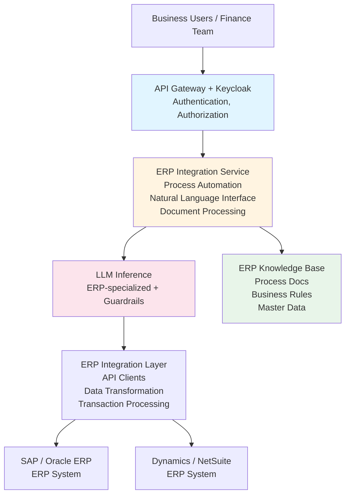

# ERP Integration with LLM

A reference architecture for integrating LLM capabilities with Enterprise Resource Planning (ERP) systems to enable intelligent process automation, natural language reporting, and decision support.

## TL;DR

Want to let business users query your ERP in plain English and automate routine processes? This architecture shows you how to connect LLMs to ERP systems (SAP, Oracle, Dynamics, NetSuite) safely. Users ask questions, system executes processes, generates reports. Expect 4-6 months implementation with 3-5 engineers. **Warning**: ERP data is highly sensitive - security is non-negotiable.

**Quick Assessment**:
- **Complexity**: ⭐⭐⭐⭐ (4/5) - High complexity, requires ERP and security expertise
- **Time to Deploy**: 4-6 months for full implementation
- **Team Size**: 3-5 engineers (ERP Specialist, Backend Developer, Security Engineer, ML Engineer)
- **Cost Estimate**: $100K-$300K first year (infrastructure + development + ERP licenses)
- **Minimum Maturity Level**: Level 3 (Defined) - ERP data is too sensitive for lower levels

**Before You Start**:
- [ ] Do you have ERP system with API access?
- [ ] Is your security team ready for financial data?
- [ ] Do you have defined approval workflows?
- [ ] Can you commit to 4+ month implementation timeline?
- [ ] Do you have ERP expertise in-house?

**When NOT to Use This Architecture**:
- Small organization (< 500 employees) - ERP integration is complex and expensive
- No ERP system - build that first
- No security maturity (Level 1-2) - financial data requires strong security
- Need deployment in < 3 months - this needs careful planning

## Overview

This architecture shows you how to connect LLM services to your ERP systems (SAP, Oracle ERP Cloud, Microsoft Dynamics, NetSuite, etc.) in a way that's both powerful and secure. Users can interact with ERP using natural language, automate routine processes, and generate intelligent reports - all while maintaining strict security and compliance requirements. Financial data is sensitive, so we've built security in from the ground up.

## Business Value

- **Efficiency**: Automate routine ERP processes and data entry
- **Accessibility**: Enable business users to interact with ERP using natural language
- **Insights**: Generate insights from ERP data
- **Compliance**: Ensure process compliance and audit readiness
- **Productivity**: Reduce time spent on manual ERP tasks

## Architecture Components

### 1. ERP System Integration

#### Supported ERP Systems
- **SAP**: SAP ERP, SAP S/4HANA
- **Oracle ERP Cloud**: Oracle's cloud ERP solution
- **Microsoft Dynamics 365**: Microsoft's ERP platform
- **NetSuite**: Oracle NetSuite ERP
- **Infor**: Infor ERP solutions
- **Workday**: Workday Financial Management
- **Custom ERP**: Integration with custom ERP systems

#### Integration Methods
- **REST APIs**: Modern REST API integration
- **SOAP APIs**: Legacy SOAP-based integration
- **Database Integration**: Direct database access (where permitted)
- **File-Based Integration**: EDI, CSV, XML file processing
- **Middleware**: Enterprise Service Bus (ESB) integration

### 2. Process Automation

#### Transaction Processing
- **Purchase Order Processing**: Automate PO creation and approval
- **Invoice Processing**: Extract and process invoice data
- **Inventory Management**: Automate inventory transactions
- **Financial Posting**: Automate journal entries and postings

#### Workflow Automation
- **Approval Workflows**: Automate approval processes
- **Notification Generation**: Generate and send notifications
- **Task Assignment**: Automatically assign tasks
- **Status Updates**: Update process status automatically

### 3. LLM Layer

#### Specialized Models
- **ERP Model**: Fine-tuned for ERP-specific tasks
- **Process Model**: Understand and execute ERP processes
- **Report Generation Model**: Generate ERP reports
- **Decision Support Model**: Provide decision support

#### ERP Knowledge Base
- **Process Documentation**: ERP process documentation
- **Business Rules**: Business rules and policies
- **Chart of Accounts**: Financial chart of accounts
- **Master Data**: Product, customer, vendor master data

### 4. Natural Language Interface

#### Query Processing
- **Natural Language Queries**: Process natural language queries
- **Intent Classification**: Classify user intent
- **Entity Extraction**: Extract entities from queries
- **Query Translation**: Translate to ERP operations

#### Command Execution
- **Process Commands**: Execute ERP processes via natural language
- **Data Retrieval**: Retrieve ERP data using natural language
- **Report Generation**: Generate reports from natural language requests
- **Status Queries**: Query process and transaction status

### 5. Reporting & Analytics

#### Report Generation
- **Automated Reports**: Generate scheduled reports
- **Ad-Hoc Reports**: Generate on-demand reports
- **Custom Reports**: Create custom reports from natural language
- **Report Distribution**: Distribute reports automatically

#### Analytics & Insights
- **Financial Analytics**: Analyze financial data
- **Operational Analytics**: Analyze operational metrics
- **Trend Analysis**: Identify trends in ERP data
- **Anomaly Detection**: Detect anomalies in processes and data

### 6. Document Processing

#### Document Extraction
- **Invoice Extraction**: Extract data from invoices
- **Purchase Order Extraction**: Extract PO information
- **Receipt Processing**: Process receipts and expense documents
- **Contract Analysis**: Analyze contracts and agreements

#### Document Generation
- **Report Generation**: Generate formatted reports
- **Document Templates**: Use templates for document generation
- **Multi-format Support**: Support PDF, Excel, Word formats
- **Localization**: Support multiple languages and formats

### 7. Security & Compliance

#### Access Control
- **Role-Based Access**: Integrate with ERP role-based access
- **Transaction Authorization**: Verify transaction authorization
- **Segregation of Duties**: Enforce segregation of duties
- **Approval Workflows**: Require approvals for sensitive operations

#### Compliance
- **Audit Trails**: Maintain comprehensive audit trails
- **Regulatory Compliance**: Ensure regulatory compliance (SOX, etc.)
- **Data Integrity**: Ensure data integrity and accuracy
- **Change Management**: Track all changes to ERP data

## Architecture Diagram



## Implementation Details

### Natural Language to ERP Transaction

```python
# Pseudo-code for NL to ERP transaction
class ERPIntegration:
    def process_natural_language_command(self, command: str, user: User):
        # Classify intent
        intent = self.classify_intent(command)
        
        # Extract entities
        entities = self.extract_entities(command)
        
        # Map to ERP operation
        if intent == 'create_purchase_order':
            po_data = self.extract_po_data(entities)
            # Validate and create PO
            po = self.erp.create_purchase_order(
                data=po_data,
                user=user,
                approval_required=True
            )
            return po
        
        elif intent == 'query_inventory':
            inventory_query = self.build_inventory_query(entities)
            results = self.erp.query_inventory(inventory_query)
            return self.format_results(results)
```

### Invoice Processing

```python
# Pseudo-code for invoice processing
class InvoiceProcessing:
    def process_invoice(self, invoice_document: Document):
        # Extract invoice data using LLM
        invoice_data = self.llm.extract_invoice_data(
            document=invoice_document,
            schema={
                'vendor': str,
                'invoice_number': str,
                'date': date,
                'line_items': list,
                'total_amount': decimal,
                'tax_amount': decimal
            }
        )
        
        # Validate invoice data
        validation_result = self.validate_invoice(invoice_data)
        
        if validation_result.valid:
            # Match to purchase order
            po_match = self.match_to_po(invoice_data)
            
            # Create invoice in ERP
            invoice = self.erp.create_invoice(
                data=invoice_data,
                po_reference=po_match
            )
            
            # Route for approval
            self.route_for_approval(invoice)
            
            return invoice
```

## Security Considerations

### Access Control
- **ERP Role Integration**: Integrate with ERP role-based access
- **Transaction Authorization**: Verify user authorization for transactions
- **Segregation of Duties**: Enforce segregation of duties
- **Approval Requirements**: Require approvals for sensitive operations

### Data Protection
- **Data Encryption**: Encrypt sensitive ERP data
- **Audit Logging**: Comprehensive audit logging
- **Data Integrity**: Ensure data integrity
- **Backup & Recovery**: Regular backups and disaster recovery

### Compliance
- **SOX Compliance**: Sarbanes-Oxley Act compliance
- **Financial Regulations**: Comply with financial regulations
- **Audit Requirements**: Meet audit requirements
- **Change Management**: Track all changes

## Example Use Cases

### Natural Language Queries
**User**: "Show me accounts payable aging report for last month"

**System**:
- Understands query intent
- Generates ERP query
- Executes query
- Formats and returns results

### Process Automation
**User**: "Create a purchase order for 100 units of product X from vendor Y"

**System**:
- Extracts purchase order details
- Validates data
- Creates PO in ERP
- Routes for approval
- Confirms creation

### Invoice Processing
**Scenario**: Invoice received via email

**System**:
- Extracts invoice data
- Validates invoice
- Matches to purchase order
- Creates invoice in ERP
- Routes for approval

### Report Generation
**User**: "Generate monthly financial summary report"

**System**:
- Identifies report requirements
- Generates ERP queries
- Executes queries
- Formats report
- Distributes to stakeholders

## Monitoring & Observability

### Key Metrics
- Transaction processing time
- Process automation success rate
- Data extraction accuracy
- User satisfaction
- Error rates
- ERP operation latency

### Alerts
- ERP integration failures
- Transaction errors
- Process failures
- High error rates
- Performance degradation

### Logging
- All ERP operations
- Transaction events
- Process automation events
- User interactions
- Error events

## Integration Patterns

### Real-Time Integration
- Real-time transaction processing
- Immediate data synchronization
- Event-driven architecture

### Batch Integration
- Scheduled batch processing
- Bulk data operations
- ETL-like workflows

### Hybrid Integration
- Real-time for critical operations
- Batch for bulk operations
- Optimized for performance and cost

## Security and Compliance Recommendations

### Organization Size and Maturity

**SMB (50-500 employees)**: ⚠️ **Not Recommended** - ERP data is highly sensitive, requires strong security
**Mid-Market (500-5,000)**: ✅ Recommended with enhanced security (MFA, encryption, strict access controls)
**Large Enterprise (5,000+)**: ✅ Highly recommended with full security (zero-trust, SIEM, segregation of duties)
**Regulated Industries**: ✅ Required with maximum security (24/7 SOC, immutable logs, compliance automation)

### Security Maturity Requirements

- **Level 3+**: Minimum for ERP integration (financial data is sensitive)
- **Level 4+**: Recommended for production use
- **Level 5**: Required for regulated industries (SOX, PCI-DSS)

### Data Classification Support

- **Confidential**: Mid-Market+, maturity level 3+ (standard financial data)
- **Restricted**: Large Enterprise, maturity level 4+ (sensitive financial data)
- **Top Secret**: Regulated industries, maturity level 5 (classified financial data)

### Critical Security Controls

1. **Segregation of Duties**: Critical for financial systems - enforce separation
2. **Approval Workflows**: Multi-level approval for sensitive transactions
3. **Audit Trails**: Comprehensive audit logging for all financial operations
4. **Data Integrity**: Ensure financial data accuracy and integrity
5. **Access Control**: Strict RBAC + ABAC with approval workflows
6. **Encryption**: Encrypt financial data at rest and in transit

### Compliance Considerations

- **SOX**: Required for public companies - financial data integrity, audit trails, access controls
- **PCI-DSS**: Required if processing payments - network segmentation, encryption
- **GDPR**: Required for EU data - PII protection, right to deletion
- **ISO 27001**: Recommended for large enterprises - comprehensive security framework

## Common Issues and Solutions

ERP integrations are complex - here's what usually goes wrong:

### Transaction Authorization Failures

**Symptoms**: Transactions rejected by ERP, "unauthorized" errors

**Common Causes**:
- User doesn't have required permissions in ERP
- Segregation of duties violations
- Approval workflows not configured correctly

**Solutions**:
1. **Verify permissions**: Check user has required ERP roles before attempting transaction
2. **Implement approval workflows**: Require approvals for sensitive transactions
3. **Test permissions**: Create test users with different roles, verify access
4. **Error handling**: Provide clear error messages when authorization fails
5. **Audit all attempts**: Log all authorization failures for investigation

### Data Integrity Issues

**Symptoms**: Incorrect financial data in ERP, reconciliation failures

**Common Causes**:
- LLM generates incorrect transaction data
- Data transformation errors
- Missing validation

**Solutions**:
1. **Validate all data**: Validate transaction data before sending to ERP
2. **Business rule validation**: Check against ERP business rules
3. **Human review**: Require human approval for financial transactions
4. **Reconciliation**: Regular reconciliation between LLM-generated and ERP data
5. **Rollback capability**: Ability to reverse incorrect transactions

### ERP API Complexity

**Symptoms**: Integration fails, API errors, complex ERP APIs

**Common Causes**:
- ERP APIs are complex (especially SAP)
- API version changes
- Authentication issues
- Rate limiting

**Solutions**:
1. **Use ERP-specific libraries**: Use official SDKs when available
2. **Abstract complexity**: Build abstraction layer over ERP APIs
3. **Handle versioning**: Support multiple API versions, plan for upgrades
4. **Respect rate limits**: Implement proper rate limiting
5. **Comprehensive error handling**: Handle all ERP error codes gracefully

**Example SAP Integration**:
```python
# Use SAP Python client library
from pyrfc import Connection

# Connect to SAP
conn = Connection(
    ashost='sap-server',
    sysnr='00',
    client='100',
    user='username',
    passwd='password'
)

# Call BAPI function
result = conn.call('BAPI_PO_CREATE', **po_data)
```

### Process Compliance Violations

**Symptoms**: Processes don't follow company policies, audit findings

**Common Causes**:
- LLM doesn't understand business rules
- Approval workflows bypassed
- Segregation of duties not enforced

**Solutions**:
1. **Document business rules**: Explicitly document all business rules
2. **Enforce in code**: Don't rely on LLM to follow rules - enforce in application
3. **Regular audits**: Audit processes regularly for compliance
4. **Training**: Train LLM with compliance examples
5. **Human oversight**: Critical processes should have human review

## Related Documents

- [On-Premise LLM Infrastructure](./on-premise-llm-infrastructure.md)
- [Financial Analyst Assistant](./financial-analyst-assistant.md)
- [Data Warehouse Integration](./data-warehouse-integration.md)
- [Threat Model](./threat-model.md)
- [Cybersecurity Framework](../cybersecurity-framework.md)

## Tools & Technologies

- **LLM Serving**: vLLM or TensorRT-LLM
- **RAG Framework**: LangChain or LlamaIndex
- **Vector DB**: Milvus (for ERP knowledge base)
- **ERP APIs**: SAP, Oracle, Dynamics APIs
- **Authentication**: Keycloak
- **Monitoring**: Prometheus, Grafana

