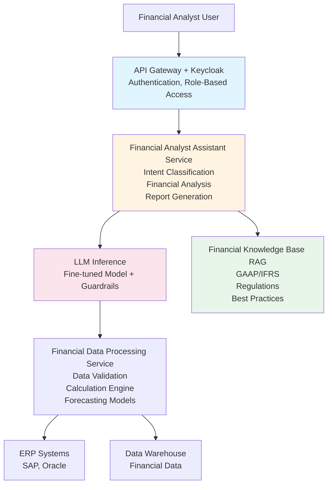

# Financial Analyst Assistant

A reference architecture for an LLM-powered assistant that helps financial analysts with financial analysis, reporting, forecasting, and compliance tasks in an enterprise environment.

## Overview

This architecture provides a specialized AI assistant for financial analysts that can help with financial data analysis, report generation, forecasting, risk assessment, and regulatory compliance. The system integrates with financial systems, ERP platforms, and data warehouses while maintaining strict security and audit requirements.

## Business Value

- **Efficiency**: Automate routine financial analysis tasks
- **Accuracy**: Reduce errors in financial calculations and reporting
- **Compliance**: Ensure regulatory compliance and audit readiness
- **Insights**: Generate actionable financial insights
- **Accessibility**: Enable non-financial users to access financial data

## Architecture Components

### 1. Financial Data Integration

#### Data Sources
- **ERP Systems**: SAP, Oracle Financials, NetSuite
- **Accounting Systems**: QuickBooks, Xero
- **Banking APIs**: Transaction data, account balances
- **Market Data**: Stock prices, exchange rates, market indices
- **Internal Systems**: Budget systems, forecasting tools

#### Data Processing
- **ETL Pipelines**: Extract, transform, load financial data
- **Data Validation**: Validate financial data integrity
- **Reconciliation**: Automated reconciliation processes
- **Data Enrichment**: Add context and metadata

### 2. Financial Analysis Engine

#### Analysis Capabilities
- **Financial Statement Analysis**: Income statements, balance sheets, cash flow
- **Ratio Analysis**: Financial ratios, trend analysis
- **Variance Analysis**: Budget vs. actual, forecast vs. actual
- **Trend Analysis**: Historical trends, seasonality
- **Comparative Analysis**: Period-over-period, year-over-year

#### Calculation Engine
- **Financial Formulas**: Pre-built financial calculation library
- **Custom Calculations**: User-defined financial formulas
- **Validation Rules**: Ensure calculation accuracy
- **Audit Trail**: Track all calculations and assumptions

### 3. LLM Layer

#### Specialized Models
- **Financial Language Model**: Fine-tuned on financial data
- **Code Generation**: Generate financial analysis code (Python, R)
- **Report Generation**: Generate narrative financial reports
- **Explanation Model**: Explain financial concepts and calculations

#### Financial Knowledge Base
- **GAAP/IFRS Knowledge**: Accounting standards and principles
- **Financial Terminology**: Comprehensive financial dictionary
- **Regulatory Requirements**: Compliance requirements by jurisdiction
- **Best Practices**: Financial analysis best practices

### 4. Reporting & Visualization

#### Report Generation
- **Automated Reports**: Monthly, quarterly, annual reports
- **Ad-Hoc Reports**: On-demand report generation
- **Report Templates**: Standardized report templates
- **Narrative Generation**: Written analysis and commentary

#### Visualization
- **Financial Charts**: P&L charts, balance sheet visualizations
- **Trend Charts**: Time series visualizations
- **Comparison Charts**: Side-by-side comparisons
- **Dashboard Creation**: Interactive financial dashboards

### 5. Forecasting & Planning

#### Forecasting Models
- **Time Series Forecasting**: Revenue, expenses, cash flow
- **Scenario Analysis**: What-if analysis, sensitivity analysis
- **Budget Planning**: Budget creation and variance analysis
- **Financial Modeling**: Build and analyze financial models

#### Planning Tools
- **Budget Allocation**: Assist with budget allocation decisions
- **Resource Planning**: Resource requirement planning
- **Strategic Planning**: Long-term financial planning support

### 6. Compliance & Audit

#### Regulatory Compliance
- **GAAP Compliance**: Ensure GAAP accounting standards
- **IFRS Compliance**: International Financial Reporting Standards
- **SOX Compliance**: Sarbanes-Oxley Act compliance
- **Tax Compliance**: Tax calculation and reporting

#### Audit Support
- **Audit Trail**: Complete audit log of all operations
- **Documentation**: Auto-generate audit documentation
- **Reconciliation Reports**: Automated reconciliation reports
- **Exception Reporting**: Identify and report exceptions

### 7. Security & Access Control

#### Authentication & Authorization
- **Role-Based Access**: Financial roles (CFO, Controller, Analyst)
- **Data Access Control**: Restrict access to sensitive financial data
- **Approval Workflows**: Multi-level approval for sensitive operations
- **Segregation of Duties**: Enforce separation of duties

#### Data Protection
- **Encryption**: Encrypt financial data at rest and in transit
- **PII Protection**: Protect personally identifiable information
- **Data Masking**: Mask sensitive data in non-production environments
- **Access Logging**: Comprehensive access logging

## Architecture Diagram



## Implementation Details

### Financial Analysis Workflow

```python
# Pseudo-code for financial analysis
class FinancialAnalystAssistant:
    def analyze_financial_statement(self, statement_type: str, period: str, user: User):
        # Retrieve financial data
        financial_data = self.get_financial_data(statement_type, period, user)
        
        # Perform analysis
        analysis = self.perform_analysis(financial_data, statement_type)
        
        # Generate insights using LLM
        insights = self.llm.generate_insights(
            financial_data=financial_data,
            analysis=analysis,
            context=self.get_financial_context()
        )
        
        # Generate report
        report = self.generate_report(analysis, insights)
        
        return report
```

### Financial Calculation Engine

The system includes a comprehensive financial calculation library:

- **Financial Ratios**: Liquidity, profitability, efficiency, leverage ratios
- **Valuation Metrics**: NPV, IRR, payback period, ROI
- **Time Value of Money**: Present value, future value, annuities
- **Risk Metrics**: VaR, Sharpe ratio, beta
- **Forecasting**: Moving averages, exponential smoothing, ARIMA

### Report Generation Flow

1. **User Request**: "Generate Q4 2024 financial report"
2. **Data Retrieval**: Fetch financial data for Q4 2024
3. **Analysis**: Perform financial analysis and calculations
4. **Insight Generation**: LLM generates insights and commentary
5. **Report Assembly**: Combine data, analysis, and insights
6. **Review**: Present for review and approval
7. **Distribution**: Distribute to stakeholders

## Security Considerations

### Access Control
- **Role-Based Access**: Strict role-based access control
- **Data Classification**: Classify financial data by sensitivity
- **Approval Workflows**: Require approvals for sensitive operations
- **Segregation of Duties**: Enforce separation of duties

### Data Protection
- **Encryption**: Strong encryption for financial data
- **Audit Logging**: Comprehensive audit trails
- **Data Retention**: Comply with data retention policies
- **Backup & Recovery**: Regular backups and disaster recovery

### Compliance
- **Regulatory Compliance**: Ensure compliance with financial regulations
- **Audit Readiness**: Maintain audit-ready documentation
- **Data Integrity**: Ensure data integrity and accuracy
- **Change Management**: Track all changes to financial data

## Example Use Cases

### Financial Statement Analysis
**User**: "Analyze the Q4 income statement and highlight key trends"

**Assistant**: 
- Retrieves Q4 income statement data
- Calculates key financial ratios
- Compares with previous quarters
- Identifies trends and anomalies
- Generates narrative analysis
- Creates visualizations

### Budget Variance Analysis
**User**: "Show me budget vs. actual for the marketing department"

**Assistant**:
- Retrieves budget and actual data
- Calculates variances (absolute and percentage)
- Identifies significant variances
- Explains potential causes
- Suggests corrective actions

### Forecasting
**User**: "Forecast next quarter's revenue based on historical data"

**Assistant**:
- Analyzes historical revenue data
- Identifies trends and seasonality
- Applies forecasting models
- Generates forecast with confidence intervals
- Explains assumptions and methodology

### Compliance Check
**User**: "Verify that our financial statements comply with GAAP"

**Assistant**:
- Reviews financial statements
- Checks against GAAP requirements
- Identifies any compliance issues
- Provides recommendations
- Generates compliance report

## Monitoring & Observability

### Key Metrics
- Analysis generation time
- Report generation time
- Calculation accuracy
- User satisfaction
- Compliance score

### Alerts
- Data quality issues
- Compliance violations
- Unusual financial patterns
- Access violations
- System errors

### Logging
- All financial operations
- Data access events
- Calculation results
- Report generations
- User interactions

## Integration Points

### Financial Systems
- ERP systems (SAP, Oracle, NetSuite)
- Accounting software (QuickBooks, Xero)
- Banking APIs
- Market data providers

### Reporting Tools
- Excel integration
- PDF generation
- Email distribution
- Dashboard tools (Tableau, Power BI)

### Compliance Systems
- Audit systems
- Regulatory reporting systems
- Document management systems

## Performance Targets

- **Analysis Generation**: < 5 seconds (P95)
- **Report Generation**: < 30 seconds for standard reports
- **Concurrent Users**: Support 20+ concurrent analysts
- **Data Sync**: < 15 minutes from source system update

## Advanced Features

### Natural Language Queries
- "What was our profit margin last quarter?"
- "Compare revenue across regions"
- "Show me cash flow trends for the last year"

### Automated Insights
- Identify anomalies automatically
- Suggest areas for investigation
- Highlight opportunities and risks

### Collaborative Features
- Share analyses with team
- Comment and annotate reports
- Version control for financial models

## Security and Compliance Recommendations

### Organization Size and Maturity

**SMB (50-500 employees)**: ⚠️ **Not Recommended** - Financial data requires strong security controls
**Mid-Market (500-5,000)**: ✅ Recommended with enhanced security (MFA, encryption, audit logs)
**Large Enterprise (5,000+)**: ✅ Highly recommended with full security (zero-trust, SIEM, compliance automation)
**Regulated Industries**: ✅ Required with maximum security (24/7 SOC, immutable logs, SOX compliance)

### Security Maturity Requirements

- **Level 3+**: Minimum for financial data processing
- **Level 4+**: Recommended for production use
- **Level 5**: Required for regulated industries (SOX, PCI-DSS, financial services)

### Data Classification Support

- **Confidential**: Mid-Market+, maturity level 3+ (standard financial data)
- **Restricted**: Large Enterprise, maturity level 4+ (sensitive financial data)
- **Top Secret**: Regulated industries, maturity level 5 (classified financial data)

### Critical Security Controls

1. **Role-Based Access**: Strict financial roles (CFO, Controller, Analyst)
2. **Approval Workflows**: Multi-level approval for sensitive operations
3. **Audit Trails**: Complete audit log of all financial operations
4. **Data Integrity**: Ensure calculation accuracy and data integrity
5. **Segregation of Duties**: Enforce separation of duties
6. **Encryption**: Encrypt financial data at rest and in transit

### Compliance Considerations

- **SOX**: Required for public companies - financial data integrity, audit trails
- **PCI-DSS**: Required if processing payments - encryption, access controls
- **GDPR**: Required for EU data - PII protection
- **ISO 27001**: Recommended for large enterprises

## Related Documents

- [On-Premise LLM Infrastructure](./on-premise-llm-infrastructure.md)
- [Data Analyst Assistant](./data-analyst-assistant.md)
- [Threat Model](./threat-model.md)
- [Cybersecurity Framework](../cybersecurity-framework.md)

## Tools & Technologies

- **LLM Serving**: vLLM or TensorRT-LLM
- **RAG Framework**: LangChain or LlamaIndex
- **Vector DB**: Milvus (for financial knowledge base)
- **Financial Libraries**: pandas, numpy, scipy for calculations
- **Authentication**: Keycloak
- **ERP Integration**: SAP, Oracle APIs
- **Monitoring**: Prometheus, Grafana

