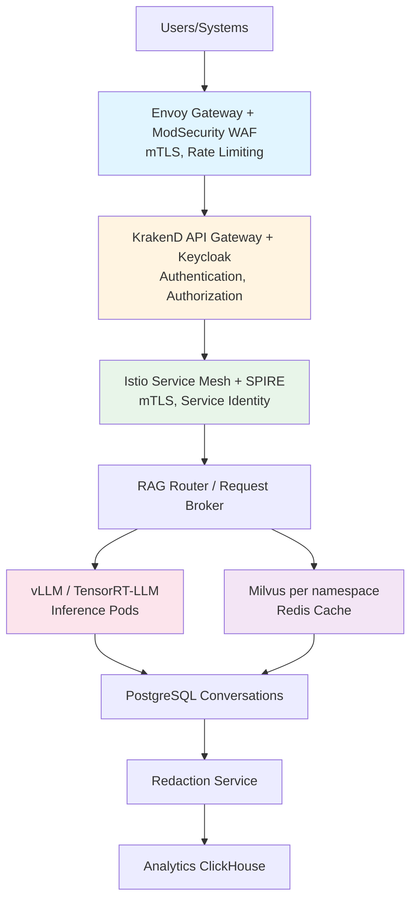

# On-Premise LLM Infrastructure Reference Architecture

A comprehensive reference architecture for deploying secure, scalable LLM services in an on-premise enterprise environment with strict security requirements, multi-tenancy, and compliance needs.

## TL;DR

If you need a production-ready, secure LLM infrastructure that you can deploy on-premise, this architecture gives you everything: API endpoints, web UI, RAG capabilities, and vector databases. We've selected proven open-source components that work together to meet enterprise security and compliance requirements. Expect 6-12 months for full implementation with a team of 5-10 engineers.

**Quick Assessment**:
- **Complexity**: ⭐⭐⭐⭐ (4/5) - Requires experienced Kubernetes and security team
- **Time to Deploy**: 6-12 months for full implementation
- **Team Size**: 5-10 engineers (DevOps, Security, ML Engineers)
- **Cost Estimate**: $200K-$500K first year (infrastructure + team)
- **Minimum Maturity Level**: Level 2 (Managed), Level 3+ recommended

**Before You Start**:
- [ ] Do you have Kubernetes expertise in-house?
- [ ] Is your security team ready for zero-trust architecture?
- [ ] Do you have budget for 24/7 monitoring?
- [ ] Can you commit to 6+ month implementation timeline?
- [ ] Do you have GPU infrastructure or cloud GPU access?

**When NOT to Use This Architecture**:
- Small teams (< 5 engineers) - consider managed cloud services
- Limited budget (< $100K/year) - infrastructure costs are significant
- No Kubernetes experience - steep learning curve
- Need deployment in < 3 months - this is a comprehensive setup
- Only need simple chat interface - overkill for basic use cases

## Overview

This architecture provides a complete on-premise deployment solution for LLM services, including API endpoints, web UI, RAG capabilities, and vector databases. We've selected proven open-source components that work together to meet enterprise security and compliance requirements. Think of it as a production-ready stack that handles everything from authentication to model serving to data governance.

## Architecture Goals

- **Security**: Zero-trust networking, encryption, access control, threat protection
- **Multi-tenancy**: Namespace isolation, resource quotas, access control per tenant
- **Scalability**: Auto-scaling, load balancing, high availability
- **Compliance**: Audit logging, data governance, PII protection, regulatory compliance
- **Observability**: Comprehensive monitoring, logging, tracing, alerting

## Use Cases

- Corporate chat assistant via web UI
- Analytical copilot (text-to-SQL for data warehouses)
- Developer assistant
- Programmatic API for batch and online analytics
- Document search and retrieval

## SLA Requirements

### Performance SLAs
- **Interactive UI**: ≤ 1.5s P95 latency, ≤ 3s P99 latency
- **Critical API**: ≤ 1.0s P95 latency, ≤ 2s P99 latency
- **Bulk API Analytics**: ≤ 5s P95 latency with async response
- **Retrieval Update**: ≤ 10 min after DWH update

### Availability SLAs
- **Tier 1 (Critical)**: 99.99% uptime (52.56 min/year downtime)
- **Tier 2 (Standard)**: 99.9% uptime (8.76 hours/year downtime)
- **Tier 3 (Batch)**: 99.5% uptime (43.8 hours/year downtime)

### Recovery SLAs
- **RTO (Recovery Time Objective)**: < 4 hours for critical services
- **RPO (Recovery Point Objective)**: < 1 hour for critical data
- **MTTR (Mean Time To Recovery)**: < 15 minutes

**Note**: For comprehensive SLA definitions and performance benchmarks, see [Performance Benchmarks](../performance-benchmarks.md). For disaster recovery planning, see [Disaster Recovery](../disaster-recovery.md).

## Architecture Components

### 1. Access Layer & Networking

#### Edge Zone
- **Envoy Gateway**: mTLS ingress, rate limiting, TLS termination
- **ModSecurity CRS**: Web Application Firewall (WAF)
- **CrowdSec**: Adaptive bot protection, threat intelligence

#### Control Zone
- **KrakenD**: API gateway, request aggregation
- **Keycloak**: Identity and access management, SSO, OAuth2/OIDC
- **OPA/Gatekeeper**: Policy enforcement, authorization

#### Service Mesh
- **Istio**: Service mesh, traffic management, mTLS
- **SPIRE**: SPIFFE identities, workload attestation
- **Cilium**: Network policies, eBPF-based security

#### Data Zone
- **Milvus**: Vector database with RBAC
- **Redis/Dragonfly**: Caching layer
- **PostgreSQL/Patroni**: Conversation storage, metadata
- **Falco**: Runtime security monitoring
- **KubeArmor**: Pod-level security policies

### 2. Model Serving & Runtime

- **vLLM**: High-performance LLM inference engine
- **TensorRT-LLM**: NVIDIA-optimized inference runtime
- **NATS JetStream / Redpanda**: Message broker for request routing
- **KEDA**: Kubernetes Event-Driven Autoscaling
- **Argo Rollouts**: Blue/Green deployments, canary releases

### 3. RAG & Retrieval

- **Milvus**: Namespace-isolated vector databases
- **LangChain/LlamaIndex**: RAG orchestration
- **NeMo Guardrails**: Content filtering and safety
- **Redis/Dragonfly**: Context caching with tenant isolation

### 4. Storage & Data Management

- **PostgreSQL (Patroni)**: Conversation storage with column-level encryption
- **Harbor**: Container and model registry with Notary signatures
- **ArgoCD/FluxCD**: GitOps for configuration management
- **ClickHouse**: Analytics and audit logging

### 5. Observability

- **OpenTelemetry**: Distributed tracing
- **Prometheus**: Metrics collection
- **Thanos**: Long-term metrics storage
- **Loki**: Log aggregation
- **Grafana**: Visualization and dashboards
- **Jaeger/Tempo**: Distributed tracing visualization

### 6. Security & Secrets

- **HashiCorp Vault**: Secrets management, PKI
- **cert-manager**: Certificate management
- **Vector.dev**: Log collection and processing
- **Curie Proxy**: Data Loss Prevention (DLP)

## Architecture Diagram



## Multi-Tenancy Model

We designed this architecture with multi-tenancy in mind from the start. Here's how it works:

- **Namespace Isolation**: Each business unit gets its own Kubernetes namespace - this gives you network-level isolation
- **Resource Quotas**: We enforce per-tenant limits on RPS, token consumption, and GPU time to prevent one tenant from starving others
- **Data Isolation**: Each tenant gets separate Milvus projects - no risk of data leakage between tenants
- **Access Control**: Your existing AD groups map to roles, and we enforce this through Keycloak + OPA - no need to rebuild your permission model

## Security Measures

We've built security in at every layer. Here's what protects your system:

### Authentication & Authorization
- **Keycloak**: Handles SSO with your existing Active Directory - users don't need new accounts
- **SPIRE**: Service-to-service authentication via SPIFFE - even if someone compromises a pod, they can't talk to other services
- **OPA**: Fine-grained authorization policies - you write policies in code, not scattered configs
- **MFA**: Multi-factor authentication for user access - required for all users, no exceptions

### Data Protection
- **Encryption**: TLS in transit (all traffic encrypted), LUKS/dm-crypt at rest (disks encrypted)
- **PII Handling**: Data redaction service automatically removes PII before it hits logs or analytics
- **Access Control**: Row-level security in PostgreSQL, Milvus RBAC - users only see what they're allowed to
- **Audit Logging**: Comprehensive audit trails in ClickHouse - we log everything, you can investigate anything

### Threat Protection
- **WAF**: ModSecurity rules catch injection attacks before they reach your apps
- **Rate Limiting**: Per-tenant rate limits prevent abuse and DoS
- **Guardrails**: NeMo Guardrails filter out dangerous content - think of it as a safety net
- **DLP**: Curie Proxy prevents data leakage - stops sensitive data from leaving your network
- **Runtime Security**: Falco and KubeArmor detect anomalies - if something weird happens, you'll know

## Deployment Considerations

### Model Registry
- **Harbor**: OCI-compliant registry with Notary signatures
- **SBOM**: Software Bill of Materials with Syft/Grype
- **GitOps**: ArgoCD for automated deployments
- **Policy Enforcement**: Kyverno policies for image validation

### Scaling
- **Horizontal Scaling**: KEDA-based auto-scaling based on queue depth
- **GPU Management**: Dynamic GPU allocation per tenant
- **Caching**: Multi-level caching (Redis, application-level)

### High Availability
- **Replication**: Database replication with Patroni
- **Load Balancing**: Envoy Gateway with health checks
- **Failover**: Argo Rollouts with blue/green deployments
- **Circuit Breakers**: Resilience4j for fault tolerance

## Monitoring & Alerting

### Key Metrics
- **Performance Metrics**: Token generation latency, queue depth, processing time
- **Resource Metrics**: GPU utilization, CPU utilization, memory usage
- **Quality Metrics**: Cache hit ratio, guardrail block rate, error rates
- **Business Metrics**: Requests per tenant, user satisfaction, cost per request
- **Availability Metrics**: Uptime, MTBF, MTTR

### Alerting Rules
- **Critical Alerts**: SLA violations (latency thresholds), system failures
- **Warning Alerts**: Resource exhaustion (GPU, memory), performance degradation
- **Security Alerts**: Failed auth, policy violations, data access anomalies
- **Quality Alerts**: High error rates, quality degradation

### Monitoring Tools
- **Metrics**: Prometheus, Thanos
- **Logging**: Loki, Elasticsearch
- **Tracing**: Jaeger, Tempo
- **Visualization**: Grafana
- **Alerting**: AlertManager, PagerDuty

**Note**: For detailed performance benchmarks and SLA definitions, see [Performance Benchmarks](../performance-benchmarks.md). For cost monitoring, see [Cost Optimization](../cost-optimization.md).

## Compliance & Governance

### Data Governance
- **Data Classification**: Public, internal, restricted (see [Data Governance](../data-governance.md))
- **Retention Policies**: Automated data lifecycle management
- **Access Reviews**: Regular access right audits
- **Data Residency**: Control over data location
- **Data Catalog**: Comprehensive data catalog and metadata management
- **Data Quality**: Data quality framework with automated monitoring
- **Data Lineage**: End-to-end data lineage tracking

### Audit & Reporting
- **Audit Logs**: All access and operations logged
- **Compliance Reports**: Automated compliance reporting (GDPR, SOC 2, HIPAA)
- **SIEM Integration**: Security event correlation
- **Data Lineage**: Track data flow and transformations
- **Compliance Monitoring**: Continuous compliance monitoring and alerting

**Note**: For comprehensive data governance framework, see [Data Governance](../data-governance.md). For compliance standards alignment, see [Enterprise Architecture Maturity](../enterprise-architecture-maturity.md).

## Implementation Phases

### Phase 1: Foundation (Months 1-3)
- Core infrastructure (Kubernetes, service mesh, ingress)
- Basic monitoring and logging
- Initial security controls
- **Maturity Target**: Level 2 (Managed)

### Phase 2: Security & Access (Months 4-6)
- Authentication and authorization (Keycloak, OPA)
- Network security and segmentation
- Security monitoring and alerting
- **Maturity Target**: Level 3 (Defined)

### Phase 3: Model Serving (Months 7-9)
- Model serving infrastructure (vLLM, TensorRT-LLM)
- Model registry and versioning
- Basic model monitoring
- **Maturity Target**: Level 3 (Defined)

### Phase 4: RAG Infrastructure (Months 10-12)
- RAG infrastructure (Milvus, LangChain)
- Vector database setup and optimization
- RAG pipeline implementation
- **Maturity Target**: Level 3 (Defined)

### Phase 5: UI & Integration (Months 13-15)
- UI and API gateway (OpenWebUI, KrakenD)
- Integration with enterprise systems
- User training and documentation
- **Maturity Target**: Level 3 (Defined)

### Phase 6: Optimization (Months 16-18)
- Advanced observability and security
- Performance optimization
- Cost optimization
- Continuous improvement
- **Maturity Target**: Level 4 (Quantitatively Managed)

**Note**: See [Enterprise Architecture Maturity](../enterprise-architecture-maturity.md) for detailed maturity assessment framework.

## Common Issues and Solutions

We've seen these issues come up repeatedly in deployments. Here's how to avoid or fix them:

### High Latency in Vector Search

**Symptoms**: Search queries take > 5 seconds, users complain about slow responses

**Common Causes**:
- Milvus collection too large (millions of vectors)
- Suboptimal index configuration (using wrong index type)
- Network latency between services
- Insufficient resources (CPU/memory)

**Solutions**:
1. **Review index type**: For large collections (>1M vectors), use HNSW instead of IVF_FLAT
2. **Partition collections**: Split large collections by tenant or data type
3. **Add caching**: Cache frequent queries in Redis (we've seen 10x improvement)
4. **Check network**: Ensure Milvus and application pods are in same zone
5. **Scale resources**: Increase Milvus pod resources if CPU-bound

**Example Milvus Index Config**:
```yaml
index_type: HNSW
metric_type: COSINE
params:
  M: 16
  efConstruction: 200
```

### Permission Checks Too Slow

**Symptoms**: Permission validation adds 2+ seconds to every request

**Common Causes**:
- Complex permission rules in OPA
- Database queries for every permission check
- No caching of permission results

**Solutions**:
1. **Cache permissions**: Cache user permissions in Redis with 5-15 min TTL
2. **Optimize OPA policies**: Simplify rules, use data structures efficiently
3. **Batch permission checks**: Check multiple permissions in one query
4. **Use in-memory cache**: For high-traffic scenarios, keep hot permissions in memory

### GPU Resource Exhaustion

**Symptoms**: Requests queuing, timeouts, GPU utilization at 100%

**Common Causes**:
- Too many concurrent requests
- Large models consuming all GPU memory
- No resource quotas per tenant
- Inefficient batching

**Solutions**:
1. **Implement quotas**: Set per-tenant GPU time limits
2. **Use smaller models**: Consider quantized models (INT8) for less critical use cases
3. **Optimize batching**: Tune vLLM batch size based on your workload
4. **Add more GPUs**: Scale horizontally if budget allows
5. **Queue management**: Use priority queues for critical requests

### Service Mesh Overhead

**Symptoms**: High latency, increased resource usage after enabling Istio

**Common Causes**:
- Sidecar proxies consuming resources
- Too many network hops
- Complex routing rules

**Solutions**:
1. **Start minimal**: Enable only mTLS and basic routing initially
2. **Optimize sidecars**: Reduce sidecar resource limits, use Istio CNI
3. **Review policies**: Simplify AuthorizationPolicy rules
4. **Consider alternatives**: For simple setups, Cilium might be lighter

### Model Deployment Failures

**Symptoms**: Models fail to deploy, pods crash, OOM errors

**Common Causes**:
- Model too large for available GPU memory
- Incorrect resource requests/limits
- Missing dependencies or incompatible versions

**Solutions**:
1. **Check model size**: Ensure GPU memory can fit model (with quantization if needed)
2. **Set proper limits**: Request enough GPU memory, add 20% overhead
3. **Test locally first**: Validate model loads before Kubernetes deployment
4. **Use model registry**: Store models in Harbor with proper versioning

**Example Resource Request**:
```yaml
resources:
  requests:
    nvidia.com/gpu: 1
    memory: "24Gi"
  limits:
    nvidia.com/gpu: 1
    memory: "24Gi"
```

### Authentication Issues

**Symptoms**: Users can't log in, SSO not working, token validation fails

**Common Causes**:
- Keycloak configuration errors
- Token expiration too short
- Network issues between services
- Certificate problems

**Solutions**:
1. **Check Keycloak logs**: Usually the issue is obvious in logs
2. **Verify token lifetime**: Increase if users complain about frequent logouts
3. **Test connectivity**: Ensure all services can reach Keycloak
4. **Review certificates**: Check cert-manager logs, ensure certs are valid

### Data Isolation Problems

**Symptoms**: Users seeing data from other tenants, permission bypasses

**Common Causes**:
- Missing namespace isolation
- Incorrect RBAC configuration
- Application-level bugs in filtering

**Solutions**:
1. **Verify namespaces**: Each tenant should have separate Kubernetes namespace
2. **Test RBAC**: Regularly audit access, use OPA for policy enforcement
3. **Add integration tests**: Test multi-tenant scenarios in CI/CD
4. **Enable audit logging**: Track all data access for investigation

## Related Documents

- [Threat Model](./threat-model.md) - Comprehensive security threat analysis
- [Data Governance](../data-governance.md) - Data governance framework and best practices
- [MLOps Lifecycle](../mlops-lifecycle.md) - Model lifecycle management
- [Enterprise Architecture Maturity](../enterprise-architecture-maturity.md) - Architecture maturity assessment
- [Performance Benchmarks](../performance-benchmarks.md) - Performance benchmarks and SLAs
- [Cost Optimization](../cost-optimization.md) - Cost optimization strategies
- [Disaster Recovery](../disaster-recovery.md) - Disaster recovery and business continuity
- [Confluence Document Search](./confluence-document-search.md) - Specific use case implementation
- [Data Analyst Assistant](./data-analyst-assistant.md) - Analytics use case

## Open Source Components

All components in this architecture are open-source:

| Component | Technology | Purpose |
|-----------|-----------|---------|
| Ingress/Mesh | Envoy Gateway, Istio, SPIRE, OPA | mTLS, rate limiting, zero-trust |
| UI/Auth | OpenWebUI, Keycloak, Ory Keto | SSO, MFA, access control |
| Model Registry | Harbor, ArgoCD, Cosign, Kyverno | Artifact signing, GitOps |
| Vector DB | Milvus, Redis/Dragonfly | Vector search, caching |
| Observability | OpenTelemetry, Prometheus, Loki | Monitoring, logging, tracing |
| Security | HashiCorp Vault, Falco, Cilium | Secrets, runtime security |
| RAG | LangChain, NeMo Guardrails | RAG orchestration, safety |

## Security and Compliance Recommendations

### Organization Size Recommendations

**Small to Medium Business (SMB) - 50-500 employees**:
- ⚠️ **Not Recommended** - Complexity too high for SMB
- **Alternative**: Consider managed cloud services or simplified architecture
- **If Deployed**: Minimal configuration, focus on core features
- **Security Level**: Basic
- **Required Controls**:
  - Basic SSO (Keycloak)
  - Basic RBAC
  - TLS encryption
  - Basic monitoring
- **Data Classification**: Public, Internal only
- **Compliance**: Basic GDPR (if EU)

**Mid-Market Enterprise - 500-5,000 employees**:
- ✅ **Recommended** with standard configuration
- **Security Level**: Medium to High
- **Required Controls**:
  - SSO with MFA (Keycloak)
  - Advanced RBAC
  - mTLS for service mesh
  - Comprehensive monitoring
  - DLP for sensitive data
  - Quarterly security assessments
- **Data Classification**: Public, Internal, Confidential
- **Compliance**: GDPR, CCPA, SOC 2 Type I

**Large Enterprise - 5,000+ employees**:
- ✅ **Highly Recommended** with full enterprise configuration
- **Security Level**: High to Very High
- **Required Controls**:
  - SSO with MFA + hardware tokens
  - Fine-grained RBAC + ABAC (OPA)
  - Full zero-trust architecture (Istio + SPIRE)
  - Comprehensive SIEM integration
  - Advanced DLP
  - UEBA for anomaly detection
  - Regular penetration testing
  - 24/7 security monitoring
- **Data Classification**: All levels including Restricted
- **Compliance**: GDPR, CCPA, SOC 2 Type II, ISO 27001

**Regulated Industries (Healthcare, Finance, Government)**:
- ✅ **Required** with enhanced security configuration
- **Security Level**: Very High to Maximum
- **Required Controls**:
  - All Large Enterprise controls +
  - Hardware security modules (HSM) for key management
  - Air-gapped deployment options for Top Secret
  - 24/7 dedicated SOC
  - Real-time threat intelligence
  - Immutable audit logs
  - Enhanced encryption (FIPS 140-2 validated)
  - Regular third-party security audits
  - Compliance automation and reporting
- **Data Classification**: All levels with enhanced controls for Restricted/Top Secret
- **Compliance**: HIPAA (healthcare), PCI-DSS (payments), SOX (finance), FedRAMP (government), NIST 800-53 (government)

### Security Maturity Level Recommendations

**Level 1 (Initial)**:
- ⚠️ **Not Recommended** - Insufficient security controls
- **Minimum Required**: Level 2 before deployment
- **Focus**: Establish basic security processes first

**Level 2 (Managed)**:
- ✅ **Minimum Recommended** for basic deployment
- **Suitable For**: Internal/Confidential data, non-regulated industries
- **Required**: Basic security controls, SSO, RBAC, monitoring
- **Not Suitable For**: Restricted/Top Secret data, regulated industries

**Level 3 (Defined)**:
- ✅ **Recommended** for standard enterprise deployment
- **Suitable For**: Most business use cases, Confidential data
- **Required**: Advanced security controls, comprehensive monitoring, regular assessments
- **Can Support**: Most compliance requirements (GDPR, SOC 2)

**Level 4 (Quantitatively Managed)**:
- ✅ **Highly Recommended** for critical deployments
- **Suitable For**: Restricted data, critical business functions
- **Required**: Zero-trust architecture, advanced threat detection, continuous monitoring
- **Can Support**: Most regulated industry requirements

**Level 5 (Optimizing)**:
- ✅ **Required** for regulated industries and Top Secret data
- **Suitable For**: All data classifications, all compliance requirements
- **Required**: Maximum security controls, 24/7 SOC, threat intelligence, continuous improvement
- **Can Support**: All compliance frameworks including FedRAMP, NIST 800-53

### Data Classification and Security Controls

**Public Data**:
- **Controls**: Basic access control, TLS 1.3, basic logging
- **Suitable For**: SMB, Mid-Market, maturity level 2+
- **Compliance**: Basic data protection

**Internal Data**:
- **Controls**: RBAC, TLS 1.3, comprehensive logging
- **Suitable For**: Mid-Market+, maturity level 2+
- **Compliance**: GDPR (if EU), basic data protection

**Confidential Data**:
- **Controls**: Advanced RBAC + ABAC, mTLS, comprehensive logging + SIEM, DLP
- **Suitable For**: Large Enterprise, maturity level 3+
- **Compliance**: GDPR, CCPA, SOC 2, ISO 27001

**Restricted Data**:
- **Controls**: Fine-grained RBAC + ABAC + approval, mTLS + pinning, real-time monitoring + UEBA, advanced DLP, air-gapped options
- **Suitable For**: Large Enterprise, Regulated Industries, maturity level 4+
- **Compliance**: All above + HIPAA, PCI-DSS, SOX (as applicable)

**Top Secret Data**:
- **Controls**: Maximum security, air-gapped deployment, HSM, 24/7 SOC, immutable logs, enhanced encryption
- **Suitable For**: Regulated Industries, Government, maturity level 5
- **Compliance**: All above + FedRAMP, NIST 800-53, classified data requirements

### Compliance Requirements Mapping

**GDPR (EU Data Processing)**:
- **Required For**: All organizations processing EU personal data
- **Key Requirements**: 
  - PII protection and encryption
  - Consent management
  - Right to deletion
  - Data portability
  - Privacy by design
- **Implementation**: 
  - Data classification framework
  - Encryption at rest and in transit
  - Access controls and audit logging
  - Data retention policies
  - PII detection and redaction

**HIPAA (Healthcare Data)**:
- **Required For**: Healthcare organizations, PHI processing
- **Key Requirements**:
  - PHI encryption (AES-256)
  - Access controls and audit logs
  - Breach notification (72 hours)
  - Business associate agreements
- **Implementation**:
  - Enhanced encryption for PHI
  - Strict access controls with approval workflows
  - Comprehensive audit trails
  - Automated breach detection and notification
  - Regular security risk assessments

**PCI-DSS (Payment Card Data)**:
- **Required For**: Organizations processing payment cards
- **Key Requirements**:
  - Cardholder data protection
  - Network segmentation
  - Access controls
  - Regular security testing
- **Implementation**:
  - Network isolation for cardholder data
  - Encryption for cardholder data
  - Strict access controls
  - Regular vulnerability scanning and penetration testing
  - Security monitoring and alerting

**SOX (Financial Reporting)**:
- **Required For**: Public companies, financial institutions
- **Key Requirements**:
  - Financial data integrity
  - Access controls
  - Audit trails
  - Change management
- **Implementation**:
  - Comprehensive logging of all financial data access
  - Access reviews and certifications
  - Change management processes
  - Data integrity controls
  - Regular compliance audits

**ISO 27001 (Information Security)**:
- **Recommended For**: All large enterprises
- **Key Requirements**:
  - Information Security Management System (ISMS)
  - Risk assessment and treatment
  - Security controls implementation
  - Continuous improvement
- **Implementation**:
  - Comprehensive security control framework
  - Risk management processes
  - Security awareness and training
  - Regular security assessments
  - Continuous monitoring and improvement

**FedRAMP (Government Cloud)**:
- **Required For**: Government agencies, contractors
- **Key Requirements**:
  - NIST 800-53 controls
  - Continuous monitoring
  - Third-party assessments
  - Security documentation
- **Implementation**:
  - Full NIST 800-53 control implementation
  - Continuous monitoring and reporting
  - Regular third-party assessments
  - Comprehensive security documentation

### Risk-Based Deployment Recommendations

**Low Risk Use Cases** (Public/Internal data, non-regulated):
- **Recommended Architecture**: Simplified version
- **Security Controls**: Basic to medium
- **Maturity Level**: 2-3
- **Compliance**: Basic (GDPR if EU)

**Medium Risk Use Cases** (Confidential data, standard business):
- **Recommended Architecture**: Standard enterprise configuration
- **Security Controls**: Medium to high
- **Maturity Level**: 3-4
- **Compliance**: GDPR, CCPA, SOC 2, ISO 27001

**High Risk Use Cases** (Restricted data, critical business):
- **Recommended Architecture**: Full enterprise configuration
- **Security Controls**: High to very high
- **Maturity Level**: 4-5
- **Compliance**: All applicable regulations

**Very High Risk Use Cases** (Top Secret data, regulated industries):
- **Recommended Architecture**: Enhanced security configuration
- **Security Controls**: Maximum
- **Maturity Level**: 5
- **Compliance**: All applicable regulations + industry-specific

## References

- [Envoy Gateway](https://www.envoyproxy.io/)
- [Keycloak](https://www.keycloak.org/)
- [Istio](https://istio.io/)
- [Milvus](https://milvus.io/)
- [vLLM](https://github.com/vllm-project/vllm)
- [Open Policy Agent](https://www.openpolicyagent.org/)
- [Cybersecurity Framework](../cybersecurity-framework.md)
- [Security Best Practices](../security-best-practices.md)

